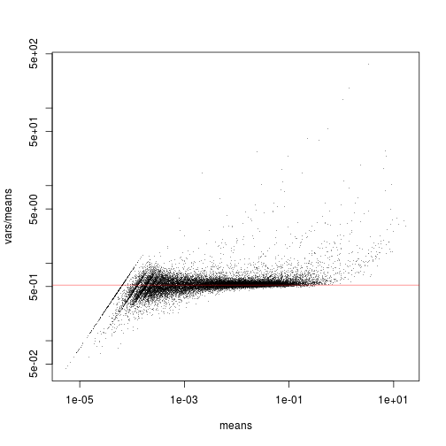
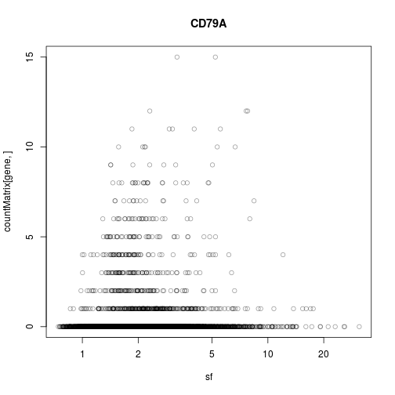
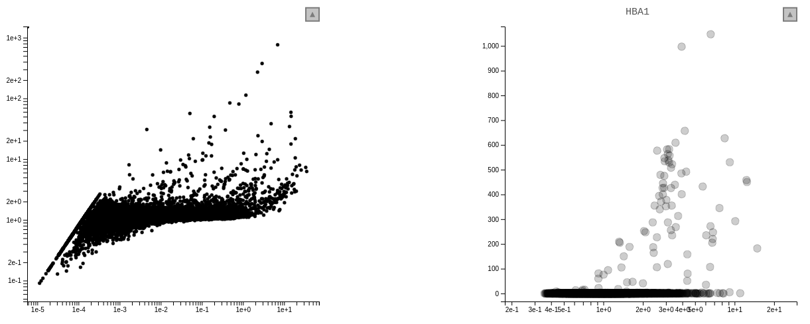
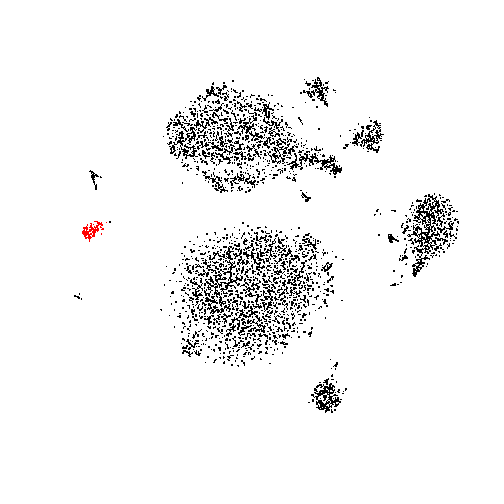

<script src = "../../src/linked-charts.min.js"></script>
<link rel="stylesheet" type="text/css" href="../../src/linked-charts.css">

## R/LinkedCharts Tutorial: 
# Exploring single-cell data with R/LinkedCharts

This tutorial demonstrates how our R/LinkedCharts package can be used to created linked scatter charts. 

We will develop an interactive app that produces, from less than a page of R code, this here:

<script type="text/javascript" src = "citeSeqData.js"></script>
<div id = "fullApp">
<table>
   <tr>
      <td id = "mean-var"></td>
      <td id = "expr"></td>
   </tr>
   <tr>
   		<td id = "tsne"></td>
   		<td id = "table"><table border="1"></table></td>
   </tr>
</table>
</div>	
<script type="text/javascript" src="fullApp.js"></script>

The app above is provided for demonstration purposes. Functionally, it is identical to what you get after running the code in R, but uses subsampled data so that not to load too big data files.

Readers in a hurry can download the final script [here](example_1_complete.R), and run it as is in R. Of course, you will have to read on to see what the different charts are supposed to show.

You can also download the file that produced this document: [example_1.Rmd](example_1.Rmd)

## Example data

As example data, we use single-cell transcriptomics data from the "CiteSeq" paper (Stoeckius et al., *Simultaneous epitope and transcriptome measurement in single cells*, [Nature Methods, 14:865](https://doi.org/10.1038/nmeth.4380), 2017). This paper describes a new method to simultaneously measure the transcriptome as well as the "epitome" (the abundance of selected surface markers) of single cells, using droplet sequencing. They demonstrate it with a 
sample of cord blood mononuclear cells.

Both the RNA-Seq and the epitome data are available from GEO ([GSE100866](https://www.ncbi.nlm.nih.gov/geo/query/acc.cgi?acc=GSE100866). We will use only the RNA-Seq data, which is available as file [`GSE100866_CBMC_8K_13AB_10X-RNA_umi.csv.gz`](https://www.ncbi.nlm.nih.gov/geo/download/?acc=GSE100866&format=file&file=GSE100866%5FCBMC%5F8K%5F13AB%5F10X%2DRNA%5Fumi%2Ecsv%2Egz) from the GEO page. 

The file contains a table with one row per gene and one column per cell, giving for each gene and each cell the number of transcript molecules (UMIs -- Unique Molecular Identifiers) detected in the cDNA of the cell that mapped to the gene. In the following, we will explore this data matrix.


## Data preparation

We first perform some very simple data preparation, using only base R commands. If you have worked with expression
data before, this will look completely familiar.

Some of these steps take time, but you can skip over them and then later just read in the R data file [citeseq_data.rda](citeseq_data.rda).

First, we load the data matrix


```r
# The path to the data file downloaded to GEO
fileName <- "~/Downloads/GSE100866_CBMC_8K_13AB_10X-RNA_umi.csv.gz"

# Load the file. (This takes a while as it is a large file.)
countMatrix <- as.matrix( read.csv( gzfile( fileName ), row.names = 1) )
```

Stoecklin et al. have spiked in a few mouse cells to their human cord blood sample for quality
control purposes, and have therefore mapped everything against both the human and the mouse genome.
We keep only the cells with nearly only human transcripts and also remove the mouse gene counts from
the data matrix.


```r
# Calculate for each cell ratio of molecules mapped to human genes
# versus mapped to mouse genes
human_mouse_ratio <- 
  colSums( countMatrix[ grepl( "HUMAN" , rownames(countMatrix) ), ] ) / 
  colSums( countMatrix[ grepl( "MOUSE" , rownames(countMatrix) ), ] )

# Keep only the cells with at least 10 times more human than mouse genes
# and keep only the counts for the human genes.
countMatrix <- countMatrix[ 
  grepl( "HUMAN" , rownames(countMatrix) ), 
  human_mouse_ratio > 10 ]

# Remove the "HUMAN_" prefix from the gene names
rownames(countMatrix) <- sub( "HUMAN_", "", rownames(countMatrix) )
```

Now, we have a matrix of counts that looks like this


```r
# size of the matrix
dim(countMatrix)
```

```
## [1] 20400  8005
```

```r
# top left corner of the matrix
countMatrix[ 1:5, 1:5 ]
```

```
##          TACAGTGTCTCGGACG GTTTCTACATCATCCC ATCATGGAGTAGGCCA
## A1BG                    0                0                0
## A1BG-AS1                0                0                0
## A1CF                    0                0                0
## A2M                     0                0                0
## A2M-AS1                 0                0                0
##          GTACGTATCCCATTTA ATGTGTGGTCGCCATG
## A1BG                    0                0
## A1BG-AS1                0                0
## A1CF                    0                0
## A2M                     0                0
## A2M-AS1                 0                0
```

Each column corresponds to a cell, identified by its DNA barcode, and each row to a gene. The 
numbers are the number of transcript molecules (UMIs -- unique molecular identifiers) from a
given cell that were mapped to the given gene.

Next, we calculate the sums of the counts for each cell, and divide them by 1000. We will call these
the "size factors" and use them for normalization: when comparing the counts from two cells, we will
consider them as comparable after dividing them by their respective size factors.


```r
sf <- colSums(countMatrix) / 1000
```

For our first example, we will ask which genes actually differ in an interesting way from cell to cell.
To this end, we calculate for each gene the mean and variance of the normalized counts


```r
means <- apply( countMatrix, 1, function(x) mean( x / sf ) )
vars <- apply( countMatrix, 1, function(x) var( x / sf ) )
```

We save these variable into an R data file, to be used later


```r
save( countMatrix, sf, means, vars, file = "citeseq_data.rda" )
```

If you want to skip over preceding steps, you can also just load this R data file from here: [citeseq_data.rda](citeseq_data.rda).

## Analysis the old-fashioned way

Here is a plot of the variance-to-mean ratios versus the means


```r
plot( means, vars / means, 
   pch = ".", log = "xy", col = adjustcolor( "black", 0.4 ) )
```

```
## Warning in xy.coords(x, y, xlabel, ylabel, log): 221 x values <= 0 omitted
## from logarithmic plot
```

```r
abline( h = mean( 1/sf ), 
	col = adjustcolor( "red", 0.5 ) )
```




All the genes that are scattering close to the red line have no or only little signal:
the Poisson noise dominates over any biological signal of interest that may there be.
Only the genes that are clearly above the red line can convey useful information.

(To understand why the red line marks the expected strength of Poisson noise, and why it
is has to be placed at `mean( 1/sf )`, please see our write-up at ... [Sorry, still under preparation at the moment.])

We can see groups of genes emerging from the horizontal clouds at different points. Which genes are these?
Are they active in only few cells or in many cells? 

It would be helpful if, for each gene, we could get a plot like this one


```r
gene <- "CD79A"

plot( sf, countMatrix[ gene, ], 
   log = "x", col = adjustcolor( "black", 0.4 ), main = gene )
```



But where is gene "CD79A" on the previous plot? And, given a specific point on the overview plot (the first one), how can
we quickly get the detail plot (the second one)?

Here we can click on a point in the left chart, to change what is displayed in the right plot:



**[[Todo: Replace this with a JS/LinkedChart app that mimics the R/LinkedChart one made below]]**

Now, we show how to create such linked charts with R/LinkedCharts.

## Using LinkedCharts

If you haven't done so yet, install the R/LinkedChart package with

```r
devtools::install_github( "anders-biostat/JsRCom" ) # required for rlc
```

```
## Downloading GitHub repo anders-biostat/JsRCom@master
## from URL https://api.github.com/repos/anders-biostat/JsRCom/zipball/master
```

```
## Installing JsRCom
```

```
## '/usr/lib/R/bin/R' --no-site-file --no-environ --no-save --no-restore  \
##   --quiet CMD INSTALL  \
##   '/tmp/RtmpeLU5sl/devtools54c6596667b8/anders-biostat-JsRCom-9dc0f33'  \
##   --library='/home/tyranchik/R/x86_64-pc-linux-gnu-library/3.5'  \
##   --install-tests
```

```
## 
```

```r
devtools::install_github( "anders-biostat/rlc" )
```

```
## Downloading GitHub repo anders-biostat/rlc@master
## from URL https://api.github.com/repos/anders-biostat/rlc/zipball/master
```

```
## Installing rlc
```

```
## '/usr/lib/R/bin/R' --no-site-file --no-environ --no-save --no-restore  \
##   --quiet CMD INSTALL  \
##   '/tmp/RtmpeLU5sl/devtools54c6f509e73/anders-biostat-rlc-0ad3c8e'  \
##   --library='/home/tyranchik/R/x86_64-pc-linux-gnu-library/3.5'  \
##   --install-tests
```

```
## 
```

```
## Reloading installed rlc
```

Load the R/LinkedCharts library

```r
library( rlc )
```

To produce the first scatter plot, use


```r
openPage( useViewer = FALSE, layout = "table2x2" )
```

```
## WebSocket opened
```

```r
lc_scatter(
  dat( 
    x = means, 
    y = vars / means,
    logScaleX = 10, 
    logScaleY = 10,
  ), 
  "A1"
)
```

```
## Chart 'A1' added.
```

```
## Layer 'Layer1' is added to chart 'A1'.
```

```
## Warning in setProperties(c(data, nonEv), id, layerId): In chart 'A1':
## Property '' doesn't exist.
```
The `openPage` function opens a new page, either in your web browser (for `useViewer=FALSE`) or
in the "Viewer" pane of RStudio (for `useViewer=TRUE`, the default). We have chosen to use a browser 
window, as the viewer pane is a bit small to show two plots side by side. As layout for our charts, we 
use a simple 2x2 grid, with four chart positions labelled "A1", "A2", "B1", and "B2".

The `lc_scatter` function inserts a scatter plot. The first argument sepcifies values for the plots parameters. Unsurprisingly, we have to pass two vectors with x and y coordinates of the points, and furthermore, we specify
a few more optional parameters: Both axes should be logarithmic, with tic marks labelling multiples
of 10. Note how all the parameters are wrapped in a call to a function named `dat`. This will be explained later.

The second parameter ("`place`") specifies where to put the plot on the page: here, at position `A1`, i.e., top left.

We will explain more details further below; but first, let's add the second plot:


```r
gene <- "CD79A"

lc_scatter(
  dat( 
    x = sf, 
    y = countMatrix[ gene, ], 
    logScaleX = 10, 
    title = gene,
    opacity = 0.4 ),
  "A2"
)
```

```
## Chart 'A2' added.
```

```
## Layer 'Layer1' is added to chart 'A2'.
```

As before, we have used `lc_scatter` to insert a scatter plot, now at position `A2` (to the right of `A1`). As before,
we use the vector `sf` for the `x` axis, and one row of `countMatrix` for the `y` axis. The variable `gene` contains
the rowname of the row to display. We also use two further optional parameters: `title` sets the plot title above the chart
(in this case the gene name, as stored in the variable `gene`), and `opacity = 0.2` renders the points semi-transparent, so
that we can better see whether several points are sitting on top of each other.

Now, we need to *link* the two charts. When the user clicks on a point in the left chart (chart A1), then the value of the variable `gene` should be changed to the name of the gene onto which the user has clicked. If we then cause the second chart (A2) to be redrawn, it will show the data for that gene. To explain to R/LinkedChart that this should happen
when the user clicks on a data point, we change the code for the first chart to the following:


```r
lc_scatter(
  dat( 
    x = means, 
    y = vars / means,
    logScaleX=10, 
    logScaleY=10,
    on_click = function( i ) {
       gene <<- rownames(countMatrix)[ i ]
       updateChart( "A2" )
    }
  ), 
  "A1"
)
```

```
## Layer 'Layer1' is added to chart 'A1'.
```

As you can see, we have merely added one more optional parameter to the `dat` block. It is called `on_click` and set
to a function. This function will now be called whenever the user clicks on a point and it gets passed, as its argument
`i`, the index of this point. We want ``gene`` to contain not the number of the gene's row but its name. Hence, we
simply look up the name of the gene as the `i`-th rowname of count matrix and write this into the variable. 

Note that
we assign to the variable `gene` using the `<<-` operator. This variant of the usual `<-` (or `=`) operator assigns to
a global rather than a local variable. Had we used the normal `<-`, R would have created a local variable called `gene`
within the function and forgot it immediately afterwards, rather than changing the global variable that we had defined before.

After changing the variable, we simply instruct R/LinkedCharts to update chart A2: `updateChart( "A2" )`. 

*This is all we need to link the two charts.*

Here, again, is the complete code. It is not much longer than the R code one would have written for normal static plots: Adding interactivity is easy with R/LinkedCharts.


```r
library( rlc )

load( "citeseq_data.rda" )

openPage( useViewer=FALSE, layout = "table2x2" )
```

```
## WebSocket opened
```

```r
gene <- "CD79A"

lc_scatter(
  dat( 
    x = means, 
    y = vars / means,
    logScaleX = 10, 
    logScaleY = 10,
    on_click = function( i ) {
       gene <<- rownames(countMatrix)[ i ]
       updateChart( "A2" )
    }
  ), 
  "A1"
)
```

```
## Chart 'A1' added.
```

```
## Layer 'Layer1' is added to chart 'A1'.
```

```r
lc_scatter(
  dat( 
    x = sf, 
    y = countMatrix[ gene, ], 
    logScaleX = 10, 
    title = gene,
    opacity = 0.4 ),
  "A2"
)
```

```
## Chart 'A2' added.
```

```
## Layer 'Layer1' is added to chart 'A2'.
```


How does it work? The call to `updateChart` causes
all the code within the `dat` function of chart A2 to be re-evaluated, and then, the new data to be sent to the browser. As `gene` has changed, the re-evaluation of the code in the `dat` call will now give different values to `y` and to
`title`, and the plot changes. This is why all the plot parameters (means, vars, etc.) have to be placed inside the `dat` call:
The `dat` function is a little trick to keep R from evaluating this code straight away when you call lc_scatter but rather to
keep the code as is in order to be able to re-evaluate it whenever needed. (In other words, `dat` just defines an anonymous
function without arguments, but does so in a manner that allows for a light, unobstructive syntax.)


## Adding a t-SNE plot

So far, our app demonstrated well the principle of using R/LinkedChart, but practitioners of single-cell transcriptomics might still find it unconvincing. Hence, let's add a bit more to make it actually useful.

In single-cell RNA-Seq, one often employs dimension reduction methods, such as [t-SNE](https://lvdmaaten.github.io/tsne/). These produce a plot with points representing the cells such that cells with similar transcriptome are closeby.

Let's use the `Rtsne` package to calculate a t-SNE plot for our expression data. (The t-SNE calculation takes a few minutes. If you don't like to wait, just load the [`citeseq_data.rda`](citeseq_data.rda) file, which contains the result.)


```r
# install.packages( "Rtsne" )   # uncomment if needed

library( Rtsne )

# Normalize the counts by dividing by the size factors and take the square root
# (The square root stabilizes the variance more robustly than the logarithm;
# please see our write-up on this [under preparation] if you are interested.)
expr <- t( apply( countMatrix, 1, function( x ) sqrt( x / sf ) ) )

# Get the names of the 1000 genes with the highest variance-to-mean ratios
varGenes <- names( tail( sort( vars/means ), 1000 ) )

# Calculate the t-SNE embedding. This may take a while.
tsne <- Rtsne( t( expr[varGenes, ] ), verbose = TRUE )
```

```
## Read the 8005 x 50 data matrix successfully!
## Using no_dims = 2, perplexity = 30.000000, and theta = 0.500000
## Computing input similarities...
## Normalizing input...
## Building tree...
##  - point 0 of 8005
## Done in 5.89 seconds (sparsity = 0.017480)!
## Learning embedding...
## Iteration 50: error is 92.686490 (50 iterations in 16.59 seconds)
## Iteration 100: error is 81.682848 (50 iterations in 14.29 seconds)
## Iteration 150: error is 79.972503 (50 iterations in 6.91 seconds)
## Iteration 200: error is 79.483382 (50 iterations in 6.93 seconds)
## Iteration 250: error is 79.238949 (50 iterations in 7.07 seconds)
## Iteration 300: error is 3.117598 (50 iterations in 6.75 seconds)
## Iteration 350: error is 2.848230 (50 iterations in 6.39 seconds)
## Iteration 400: error is 2.709155 (50 iterations in 6.24 seconds)
## Iteration 450: error is 2.622022 (50 iterations in 6.18 seconds)
## Iteration 500: error is 2.561374 (50 iterations in 6.17 seconds)
## Iteration 550: error is 2.518067 (50 iterations in 6.23 seconds)
## Iteration 600: error is 2.487800 (50 iterations in 6.28 seconds)
## Iteration 650: error is 2.464465 (50 iterations in 6.30 seconds)
## Iteration 700: error is 2.445678 (50 iterations in 6.36 seconds)
## Iteration 750: error is 2.430248 (50 iterations in 6.91 seconds)
## Iteration 800: error is 2.418950 (50 iterations in 6.70 seconds)
## Iteration 850: error is 2.409612 (50 iterations in 6.50 seconds)
## Iteration 900: error is 2.402697 (50 iterations in 6.32 seconds)
## Iteration 950: error is 2.397645 (50 iterations in 6.28 seconds)
## Iteration 1000: error is 2.395305 (50 iterations in 6.38 seconds)
## Fitting performed in 147.78 seconds.
```

```r
# Save the citeseq_data.rda file again, now, with the tsne result added
save( countMatrix, sf, means, vars, tsne, file = "citeseq_data.rda" )
```

The embedding is in the `Y` field of the object returned by `Rtsne`.
We display it with a third scatter plot:


```r
lc_scatter(
  dat( 
    x = tsne$Y[,1], 
    y = tsne$Y[,2], 
    colourValue = expr[ gene, ],
    palette = RColorBrewer::brewer.pal( 9, "YlOrRd" ),
    size = 1 ),
  "B1"
)
```

```
## Chart 'B1' added.
```

```
## Layer 'Layer1' is added to chart 'B1'.
```

This plot is now placed a position "B1", i.e., under A1. We use the two columns of the
2x*N* matrix in `tsne$Y` for x and y. Each data point represents a cell, and we use
the points' colours to indicate the expression strength of the currently selected gene.
To this end, we read the corresponding row from the `expr` matrix that we have also used to
calculate the t-SNE plot.

For the colour palette, we set the parameter `palette`. We have to provide a vector of colours, and
LinkedCharts will interpolate between these. Here, we have used the "YlOrRd" (for "Yellow-Orange-Red")
palette provided by the RColorBrewer package.

Note how it easy it is again to link this chart with the existing ones. If the use clicks on a point
on chart A1 to select a gene, the `gene` variable will be changed and this will affect what data is
shown now in both the charts A2 and B1. The only thing that is missing is that we need to change
the event handler in A1 to also update B2. So, we simply add this to the `updateChart` call from above:


```r
lc_scatter(
  dat( 
    x = means, 
    y = vars / means,
    logScaleX = 10, 
    logScaleY = 10,
    on_click = function( i ) {
       gene <<- rownames(countMatrix)[ i ]
       updateChart( c( "A2", "B1" ) )
       #            ^^     ########   <- the only change to above
    }
  ), 
  "A1"
)
```

```
## Layer 'Layer1' is added to chart 'A1'.
```

Have a look below for the final code, if you are unsure how this fits in.

Play a bit with the app. Now you can easily find out for any gene with high variability whether it is
expressed throughout, or whether is is specific to one of the clusters visible in the t-SNE embedding.
This will help us to conveniently explore and understand the t-SNE plot.

## Analysing marked cells

Mark one of the cell clusters in the t-SNE plot by drawing a rectangle with the mouse while holding the Shift key. (Drawing without Shift causes zooming in rather than selecting). You can unselect all cells by holding Shift and double-clicking. (Double-clicking without Shift undoes any zooms and returns to the original axis limits.)

After marking cells in the browser, you can go right back to your R session and inquire about them using the `getMarked` function.

I have just marked these 147 cells:


```r
marked <- getMarked( "B1" )
```

```r
> marked
  [1]    8   10   11   14   15   16   17   18   25   26   27   29   30   31
 [15]   33   35   40   42   43   44   46   48   52   54   57   63   68   73
...
[127]  671  700  733  746  774  792  793  814  824  879  884  907  927  967
[141]  975 1034 1465 1911 5803 7975 7996
```

They are all from the same small cluster at the periphery of the t-SNE plot:


```r
plot( tsne$Y, asp=1, col=1+(1:nrow(tsne$Y)%in%marked), pch=".", 
   cex=2, xaxt="n", yaxt="n", xlab="", ylab="", bty="n" )
```



What genes might have particularly high expression in
this cluster? To see, let's calculate, for each gene, mean and standard deviation first over all the marked cells and
then over all the remaining cells. To save time, let's do it only for the informative genes that we have selected above 
and stored in the variable `varGenes`.


```r
df <- data.frame(
  meanMarked   =  apply( expr[ varGenes,  marked ], 1, mean ),
  sdMarked     =  apply( expr[ varGenes,  marked ], 1, sd ),
  meanUnmarked =  apply( expr[ varGenes, -marked ], 1, mean ),
  sdUnmarked   =  apply( expr[ varGenes, -marked ], 1, sd )
)
```

Now, we can calculate a separation score for each gene, which tells us how well the distribution of this gene's expression
values in the marked cells is separated from the distribution in the unmarked cells. It's a bit like a z-score: We
take the difference of the means between marked and unmarked, and divide by the standard deviations (which we simply
add up for both groups). Notably, if the standard deviations are extremely small they blow up the score too much; we circumvent
this by 
setting a minimum value of 0.002. Not a very sophisticated approach, but it works well enough for this demonstration.


```r
df$sepScore <- ( df$meanMarked - df$meanUnmarked ) / pmax( df$sdMarked + df$sdUnmarked, 0.002 )
```

Now we have this


```r
head( df )
```

```
##             meanMarked   sdMarked meanUnmarked sdUnmarked    sepScore
## DGCR5      0.000000000 0.00000000 0.0002171349 0.01362520 -0.01593628
## AC091814.2 0.002994731 0.03630918 0.0004960033 0.02021686  0.04420489
## MIR663A    0.000000000 0.00000000 0.0003498924 0.01637477 -0.02136778
## HP         0.000000000 0.00000000 0.0053221283 0.06398697 -0.08317518
## PRKCQ-AS1  0.148005784 0.21193058 0.1709553286 0.33820823 -0.04171592
## TALDO1     0.677642630 0.27947742 0.3403140015 0.43947661  0.46919360
```

Here are the top genes, i.e., those with the highest score


```r
head( df[ order( df$sepScore, decreasing=TRUE ), ] )
```

```
##              meanMarked  sdMarked meanUnmarked sdUnmarked sepScore
## PRSS57        0.7250667 0.3690533 0.0126227363 0.10363671 1.507212
## SPINK2        0.8310036 0.4939622 0.0131388229 0.09469020 1.389385
## C1QTNF4       0.6207673 0.4672307 0.0009496667 0.02462847 1.260152
## STMN1         1.0419737 0.3661231 0.1571042083 0.35102983 1.233864
## C17orf76-AS1  2.0924204 0.3084434 1.0117939060 0.59899410 1.190855
## KIAA0125      0.6097646 0.4287839 0.0095667244 0.08837219 1.160574
```

It would be nice to have this table appear in our app. There is still space at the bottom
right-hand corner (position B2). We can use the `hwrite` function from the simple but very 
useful `hwriter` package to transform the table into HTML code


```r
html_table <- hwriter::hwrite( head( df[ order( df$sepScore, decreasing=TRUE ), ] ) )
```


```r
html_table
```

```
## [1] "<table border=\"1\">\n<tr>\n<td></td><td>meanMarked</td><td>sdMarked</td><td>meanUnmarked</td><td>sdUnmarked</td><td>sepScore</td></tr>\n<tr>\n<td>PRSS57</td><td>0.725066676278626</td><td>0.369053339059246</td><td>0.0126227362973354</td><td>0.103636705089765</td><td>1.5072116470401</td></tr>\n<tr>\n<td>SPINK2</td><td>0.831003575054457</td><td>0.493962176122786</td><td>0.013138822891984</td><td>0.0946902014959639</td><td>1.38938494646186</td></tr>\n<tr>\n<td>C1QTNF4</td><td>0.620767250693636</td><td>0.467230715177914</td><td>0.000949666672459759</td><td>0.024628474625193</td><td>1.26015249256457</td></tr>\n<tr>\n<td>STMN1</td><td>1.04197366701963</td><td>0.366123080494962</td><td>0.157104208312422</td><td>0.351029833213004</td><td>1.23386441272627</td></tr>\n<tr>\n<td>C17orf76-AS1</td><td>2.09242035687478</td><td>0.308443407217987</td><td>1.01179390598515</td><td>0.598994096952368</td><td>1.19085495797048</td></tr>\n<tr>\n<td>KIAA0125</td><td>0.609764572553002</td><td>0.42878392946118</td><td>0.00956672439381324</td><td>0.0883721856290961</td><td>1.16057382025622</td></tr>\n</table>\n"
```

This cryptic line will become nice and readable once we put it into our web app to let 
the web browser interpret the HTML code:


```r
lc_html( html_table , "B2" )
```

```
## Chart 'B2' added.
```

```
## Error: in data expression for chart 'B2': no applicable method for 'hwrite' applied to an object of class "NULL".
```
The moment your R executes this line, the table appears on the web page.

How can we make this automatic, so that all this happens whenever we mark a group of cells? Simple: We just have to write
an event handler again, only this time we use `markedUpdated` rather than `on_click`.

Let's add such an event handler to the t-SNE plot:


```r
lc_scatter(
  dat(
    x = tsne$Y[,1],
    y = tsne$Y[,2],
    colourValue = sqrt( countMatrix[ gene, ] / sf ),
    palette = RColorBrewer::brewer.pal( 9, "YlOrRd" ),
    size = 1,
    markedUpdated = function() {
       showHighGenes( getMarked( "B1" ) )
    }),
  "B1"
)
```

```
## Layer 'Layer1' is added to chart 'B1'.
```

```
## Warning in setProperties(c(data, nonEv), id, layerId): In chart 'B1':
## Property 'markedUpdated' doesn't exist.
```

And the function `showHighGenes` contains the analysis just described:


```r
showHighGenes <- function( marked ) {

  # if no genes marked, clear output, do nothing more
  if( length(marked) == 0 ) {
    lc_html( "", "B2" )
    return()
  }

  df <- data.frame(
    meanMarked   =  apply( expr[ varGenes,  marked ], 1, mean ),
    sdMarked     =  apply( expr[ varGenes,  marked ], 1, sd ),
    meanUnmarked =  apply( expr[ varGenes, -marked ], 1, mean ),
    sdUnmarked   =  apply( expr[ varGenes, -marked ], 1, sd )
  )
  df$sepScore <- ( df$meanMarked - df$meanUnmarked ) / pmax( df$sdMarked + df$sdUnmarked, 0.002 )

  html_table <- hwriter::hwrite( head( df[ order( df$sepScore, decreasing=TRUE ), ] ) )
  lc_html( html_table , "B2" )
}
```

## Everything put together

In case you got lost with the individual pieces of code, [here](example_1_complete.R) is everything put together.


## What else is there?

R/LinkedCharts has many more possibilities than this simple example could demonstrate. Here are a few:

- There are many **more options** that you can put in `dat`. We have seen the mandatory parameters `x` and `y`, and
the optional parameters `logScaleX` and `logScaleY` for logarithmic axes, `size` and opacity to control the 
appearance of the points, and `on_click` to specify how to react to user interaction.

- **Point appearance** can be specified point by point, by passing a vector of values instead of a single value. Of 
course, you can also change the **shape** and **colour** of the points (parameters **todo: fill in**)

  See here [put a link to the t-SNE tutorial] for some examples how to use this.

- The scatter charts themselves have functionality for **zooming, panning, saving plots and marking points**. Press the  
arrow button at the chart's top right corner to see.

- There are not only scatter charts: You can also add **lines** to your plots, or use a **beeswarm** chart.

- There are **heatmaps** (with and without **clustering**), with many possibilities, described in their own tutorial [hopefully written soon]

- You can create your own HTML page and embed the LinkedCharts plots inside. All you have to do is to hand the HTML file
to `openPage` and to mark the places where the charts should go with `id` tags (e.g. by putting an empty `div` tag with an ID as placeholder). Then, you can use the IDs for the `place` argument (instead of `A1`, `A2`, etc). This allows you 
to make beautiful apps with little work.

- If you want a web app that runs independent of R, you can use plain LinkedCharts instead of R/LinkedCharts. You have to write in JavaScript instead of in R, but you only have know enough to load the data and write code as simple as what we have written in R above.


## Where to find more information

**[TO DO: Links to further documentation go here.]**


## Some of the ideas behind R/LinkedCharts

### A minimalistic model-view-controller pattern

If you have experience with GUI programming, you might be familiar with the [model-view-controller](https://en.wikipedia.org/wiki/Model%E2%80%93view%E2%80%93controller) (MVC) design pattern. What we have just built 
is a most minimalistic version of this.

- First, we have a number of global variables: `countMatrix`, `means` and `vars` contain the data that we want
to show in the two charts, and `gene` specifies for which gene we want to see details in the second plot. In the 
MVC concept, this is the **model**. For complex applications, one would typically implement a class to hold all the
data that makes up the model. As R/LinkedChart is designed to allow you quickly and simply get a job done, we suggest
to simply use a few global variables, as we have done here. If you want to, you can also use a more sophisticated and
organized model. After all, you can put whatever code you like into the `dat` call. You just explain to R there how and where to find your data.

- Then, we have the calls to R/LinkedCharts functions like `lc_scatter`, with its core part, the `dat` call. They
describe how each chart should look like and how it finds its data in the model. These are the **views**.

- In the traditional MVC pattern, the **controller** is the code that handles user interactions. We have not made it a separate part but rather folded it into each chart, specifically, into its event handler parameters such as the `on_click` function above. To keep things simple, we suggest that these controller codes directly manipulate some subsets of the global variables (the model) and then take care of telling the appropriate charts to update themselves. For complex GUIs, this might seem messy, but for the quick-and-not-too-dirty programming style that one wants to use during exploratory data analysis, it is suitable -- and very straight-forward.


### LinkedCharts and JsRCom

The work horse under the hood of R/LinkedCharts is our LinkedCharts library, which is written in JavaScript, not in R. It can also used directly, in order to write stand-alone client-side data exploration apps, and offers all the functionality of R/LinkedCharts and some more. R/LinkedCharts uses our JsRCom library [documentation/tutorial to be written] to establish a bidirectional [WebSocket](https://en.wikipedia.org/wiki/WebSocket) communication between the R session on one end and the web browser session with its JavaScript interpreter on the other end. The WebSocket link is used to send data and commands (e.g., to add charts to the page) from R to JavaScript and to send event notifications about user actions (such as a mouse click) from JavaScript to R. 
