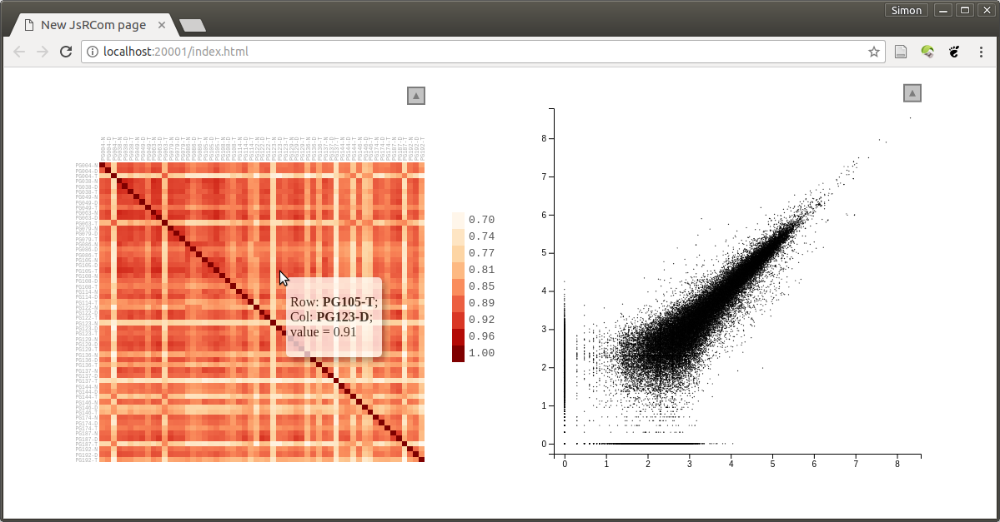
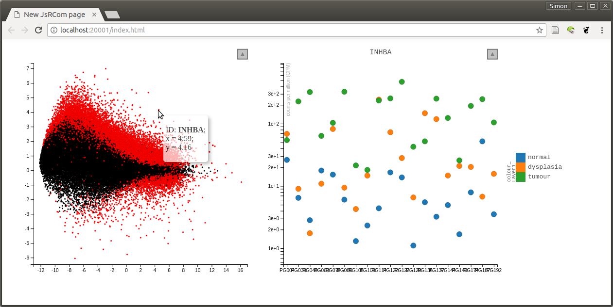

## R/LinkedCharts Tutorial
# Augmenting and checking a standard RNA-Seq analysis

In this simple tutorial, we show how to explore a standard RNA-Seq analysis.

## The data

We are working with data from this paper:

| C. Conway et al.: *Elucidating drivers of oral epithelial dysplasia formation and malignant transformation to cancer using RNAseq*. Oncotarget, 6:40186-40201 (2015), [doi:10.18632/oncotarget.5529](https://doi.org/10.18632/oncotarget.5529)

Conweay et al. have collected tissue samples from 19 patients with oral squamous
cell carcinoma (OSCC). From each patient, they took 3 samples, one of normal oral mucosa, 
one of epithelial dysplasia (i.e., abnormal but not yet malignant tissue, 
and one sample of the tumour ("T"). We will use their data (available from the European
Read Archive (ERA) under accession [PRJEB7455](https://www.ebi.ac.uk/ena/data/view/PRJEB7455))
to demonstrate how LinkedCharts can be helpful in a standard bioinformatics task like
analysing an RNA-Seq data set.

Fortunately, we do not have to redo the whole abalysis, as the Recount2 project 
(Collado Torres et al., Nature Biotechnology, 2017, [doi:10.1038/nbt.3838](https://doi.org/10.1038/nbt.3838)) 
gives us a headstart by providing a count table for this and other data sets.

Nevertheless, a bit of data wrangling is necessary, and in order to keep this tutorial short,
we describe these preparatory steps in an [appendix](data_prep.md). 

We hence start by loading the data file resulting from the preparations, which is 
available here: [oscc.rda](oscc.rda)


```r
load( "oscc.rda" )
```

We have data for 57 samples (19 patients x 3 tissue samples per patient), with the metadata in `sampleTable`:


```r
sampleTable
```

```
## # A tibble: 57 x 4
##    run_accession sample_name patient tissue   
##    <chr>         <chr>       <chr>   <fct>    
##  1 ERR649059     PG004-N     PG004   normal   
##  2 ERR649060     PG004-D     PG004   dysplasia
##  3 ERR649061     PG004-T     PG004   tumour   
##  4 ERR649035     PG038-N     PG038   normal   
##  5 ERR649018     PG038-D     PG038   dysplasia
##  6 ERR649025     PG038-T     PG038   tumour   
##  7 ERR649022     PG049-N     PG049   normal   
##  8 ERR649021     PG049-D     PG049   dysplasia
##  9 ERR649020     PG049-T     PG049   tumour   
## 10 ERR649026     PG063-N     PG063   normal   
## # ... with 47 more rows
```

Our actual data is a matrix of read counts: The samples are the columns, the rows the genes, the matrix entries the
number of RNA-Seq reads that mapped to each gene in each sample. Here is the top left corner of `countMatrix`:


```r
countMatrix[ 1:5, 1:5 ]
```

```
##          PG004-N PG004-D PG004-T PG038-N PG038-D
## TSPAN6     11642   25423    1526   37354   30699
## TNMD         405       0    1628     371       0
## DPM1       21828   32694     973   55566   33814
## SCYL3      31332   38436   11661   77985   63853
## C1orf112   14207   21808    8047   25159   25862
```

## An interactive heatmap for quality assessment

When starting to work with such data, it is usually a good idea to first assess the quality of the data. It is unlikely
that all of these many samples are of equally perfect quality. A good way to check is to calculate the correlation or distance between
all pairs of samples. We use Spearman correlation so that we don not have to worry (yet) about how to normalize and transform
the data.


```r
corrMat <- cor( countMatrix, method="spearman" )
corrMat[1:5,1:5]
```

```
##           PG004-N   PG004-D   PG004-T   PG038-N   PG038-D
## PG004-N 1.0000000 0.8927562 0.7745358 0.8963811 0.8948413
## PG004-D 0.8927562 1.0000000 0.7775693 0.9026254 0.9015365
## PG004-T 0.7745358 0.7775693 1.0000000 0.7569003 0.7538902
## PG038-N 0.8963811 0.9026254 0.7569003 1.0000000 0.9363055
## PG038-D 0.8948413 0.9015365 0.7538902 0.9363055 1.0000000
```

We visualize this matrix as a heatmap (using Raivo Kolde's `pheatmap` package)


```r
rownames(sampleTable) <- sampleTable$sample_name  # pheatmap insists on that
```

```
## Warning: Setting row names on a tibble is deprecated.
```

```r
pheatmap::pheatmap( corrMat,
   cluster_rows=FALSE, cluster_cols=FALSE,
   annotation_col = sampleTable[,c("patient","tissue")] )
```

```
## Error in cut.default(a, breaks = 100): 'x' must be numeric
```

We can see that most samples pairs correlate well with each other, with correlation coefficients
above ~0.85, in the yellow-orange colour range. Same samples, however, show consitently poorer
correlation with all other samples. But is 0.8 really a good cut point, or is this just what the 
arbitrary color scale happens to highlight?

Each square in this heatmap summerizes a scatter plot. For example, the square between relating
to the first two samples, PG004-N and PG004-D, is the Spearman correlation associated with this plot:


```r
plot( 
   log10( 1 + countMatrix[,"PG004-N"] ), 
   log10( 1 + countMatrix[,"PG004-D"] ), 
   asp=1, col=adjustcolor("black",0.2), pch=20, cex=.5 )
```


We have plotted here logarithms of the count values, $\log_{10}(k+1)$, with one pseudocount added to avoid zeroes, 
which cannot be shown in a log-log plot, because $\log 0 = -\infty$.

If we looked at several such plots for different squares in the heatmap, maybe some orange ones, a few yellow ones, and
some of the blueish ones, we could get a quick feeling about how good or bad a correlation value of 0.9 or 0.8 is.

With LinkedChart, we can do precisely that. We can display the two plots side-by-side, and when one clicks with the mouse 
on a square on the heatmap, the scatter plot will change to display the correlation between the two samples associated with 
the heatmap square.

Here is first the code to display the two plots side-by-side, for now without linking them (i.e., without handling mouse clicks):


```r
library( rlc )

openPage( useViewer=FALSE, layout="table1x2" )
```

```
## [1] "Reading /home/anders/R/x86_64-pc-linux-gnu-library/3.4/JsRCom/http_root/index.html"
## [1] "Reading /home/anders/R/x86_64-pc-linux-gnu-library/3.4/JsRCom//http_root/JsRCom.js"
## [1] "WebSocket opened"
## [1] "Reading /home/anders/R/x86_64-pc-linux-gnu-library/3.4/rlc//http_root/linked-charts.css"
## [1] "Reading /home/anders/R/x86_64-pc-linux-gnu-library/3.4/rlc//http_root/rlc.js"
## [1] "Reading /home/anders/R/x86_64-pc-linux-gnu-library/3.4/rlc//http_root/linked-charts.min.js"
```

```r
lc_heatmap(
   dat(
      value = corrMat
   ),
   place = "A1"
)
```

```
## [1] "main"
```

```
## The following `from` values were not present in `x`: labels, color, colorValue, colourValues, colorValues, colorDomain, colorLegendTitle, addColorScaleToLegend, symbols, symbolValues, strokes, values, heatmapRows, heatmapCols, showValues
```

```r
sampleX <- "PG004-N"
sampleY <- "PG004-D"

lc_scatter(
   dat(
      x = log10( 1 + countMatrix[,sampleX] ),
      y = log10( 1 + countMatrix[,sampleY] ),
      size = .3,
      alpha = .3
   ),
   place = "A2"
)
```

```
## [1] "main"
## [1] "Layer1"
```

```
## The following `from` values were not present in `x`: labels, color, colorValue, colourValues, colorValues, colorDomain, colorLegendTitle, addColorScaleToLegend, symbols, symbolValues, strokes, values, heatmapRows, heatmapCols, showValues
```

To run this code, you first need to install R/LinkedChart. If you haven't done so yet, see the simple instructions on 
the [overview page](..). 

Once you run the code, you should see, in your web browser, a picture like this. (Give the scatter plot a few seconds to appear; it has nearly 60,000 points.) Note how sample names and gene names are displayed when you hover your mouse over a square or point. You can also zoom in (draw a rectangle with the mouse) or out (double-click) or use other functions in the tool menu (click on the arrow button).



We go through this code now and explain line for line:

First, we load the R/LinkedChart package ("`rlc`"). Then, we use `openPage` to open a new page. We can open the page 
either in the web browser (`useViewer=FALSE`) or in the viewer pane of RStudio (`useViewer=TRUE`, the default). As
we have two plots, we opt for a layout with 1 row and 2 columns (`layout="table1x2"`). 

Next, we insert the first chart, teh heatmap, using the `lc_heatmap` fucntion. All charts in R/LinkedChart are placed
with functions starting with `lc_`, and they all want a first argument that sets all their data and that has to be enclosed
in `dat(...)` (which we will explain later). For a heatmap, we just need a matrix, which has to be assigned (in the `dat` phrase)
to `value`. The second argument is the `place` where the chart should be put. In our `table1x2` layout, the places are 
labelled `A1` and `A2`. (If we had, say, a `table2x2` layout, there would also be `B1` and `B2` for the second row.)

Now, we set two global variables, `sampleX` and `sampleY`, to the names of the two samples that we want to initially
display in the scatter plot.

The scatter plot is inserted with `lc_scatter`. Again, its first argument must be enclosed in `dat(...)`. Within the `dat`, we 
set four properties: `x`, `y`, `size` and `alpha`. The first two are mandatory: They are vectors with the values of the x
and y coordinates. As before, when using R's standard `plot` function, we use `log10( 1 + countMatrix[,sample])`. 

The other two properties are optional: We set `size = .3` to make the points a bit smaller than the default, and we make 
them somewhat transparent, by reducing the opacity, `alpha`, so that one can see whether several points sit on top of each other 
(similar to the use of `adjustcolor` above). We place the chart at position `A2`, to the right of the heatmap at `A1`.

Next, we need to "link" the charts. For this, we just add four very simple lines, marked below with hashes (#):


```r
library( rlc )

openPage( useViewer=FALSE, layout="table1x2" )
```

```
## [1] "Reading /home/anders/R/x86_64-pc-linux-gnu-library/3.4/JsRCom/http_root/index.html"
## [1] "Reading /home/anders/R/x86_64-pc-linux-gnu-library/3.4/JsRCom//http_root/JsRCom.js"
## [1] "WebSocket opened"
## [1] "Reading /home/anders/R/x86_64-pc-linux-gnu-library/3.4/rlc//http_root/linked-charts.css"
## [1] "Reading /home/anders/R/x86_64-pc-linux-gnu-library/3.4/rlc//http_root/rlc.js"
## [1] "Reading /home/anders/R/x86_64-pc-linux-gnu-library/3.4/rlc//http_root/linked-charts.min.js"
```

```r
sampleX <- "PG004-N"
sampleY <- "PG004-D"

lc_heatmap(
   dat(
      value = corrMat,
      on_click = function(k) {     #  \  
         sampleX <<- k[1]          #  |  Linking the
         sampleY <<- k[2]          #  |  charts
         updateChart( "A2" )       #  /
      }
   ),
   place = "A1"
)
```

```
## [1] "main"
```

```
## The following `from` values were not present in `x`: labels, color, colorValue, colourValues, colorValues, colorDomain, colorLegendTitle, addColorScaleToLegend, symbols, symbolValues, strokes, values, heatmapRows, heatmapCols, showValues
```

```r
countMatrix_downsampled <- 
   countMatrix[ sample.int( nrow(countMatrix), 8000 ), ]

lc_scatter(
   dat(
      x = log10( 1 + countMatrix_downsampled[,sampleX] ),
      y = log10( 1 + countMatrix_downsampled[,sampleY] ),
      size = .3,
      alpha = .3
   ),
   place = "A2"
)
```

```
## [1] "main"
## [1] "Layer1"
```

```
## The following `from` values were not present in `x`: labels, color, colorValue, colourValues, colorValues, colorDomain, colorLegendTitle, addColorScaleToLegend, symbols, symbolValues, strokes, values, heatmapRows, heatmapCols, showValues
```

We have added a second property to the heatmap, inside the `dat`. The property `on_click` tells LinkedCharts what to
do when the user clicks on a square in the heatmap. It is a function with one argument, `k`, which R/LinkedChart will
call whenever a mouse-click event happens in the heatmap, and R/LinkedChart will then place in `k` the row and column 
indices of the square that was clicked.

Our `on_click` function just does two things: First, it stores the row and column indices (passed as `k[1]` and `k[2]`) in
`sampleX` and `sampleY`, the two global variables that we used to indicate which samples the scatter plot should show. Now, they
indicate that the scatter plot should show the samples corresponding to the square that has just been clicked. We only need to tell
the scatter plot that its data has changes and that it should redraw itself. Hence, the call to `updateChart`, which causes
the indicated chart (here the one at `A2`) to be redrawn.

Now we can also see why the property assignments have to be enclosed into `dat`: `dat` is a construct that keeps the code it 
encloses in an unevaluated form, so that it can be re-evaluated over and over as needed. And here, the code in the scatter plots
`dat`, e.g., `x = log10( 1 + countMatrix_downsampled[,sampleX] )`, will get a different result whenever `sampleX` has changed.

This is the general idea of LinkedCharts: You describe, with the `dat` properties, how your plot should look like, using global 
variables, which you can change, e.g., when the user clicks somewhere, and the cause the plot to be redrawn. This makes is extremely easy to link charts in the manner just shown.

One subtelty: Because the `on_click` fucntion needs to set a global variable, we have used in it the special global 
assignment operator `<<-` instead of the usual `<-` or `=`. It is important not to foget to use `<<-` as otherwise, R would
create a local variable `sampleX` and discard it immediatly instead of changing the global variable that also the other chart 
can see.

And for completeness: There is a second change in the plot above: We have downsampled the count matrix from 58,000 genes to just 8,000
genes. This is merely to ensure that the app reacts smoothly to mouse clicks also on less powerful computers. It shouldn't change the appearance of the plots much.


If you use the app, you can now easily see which samples are bad and how bad they are. For example, you will notice that they seem to have especially strong noise for the weaker genes.


## Exploring the differentially expressed genes

In the [appendix](data_prep.md), which shows the data preparation, we have also performed a differential expression analysis using limma-voom. For details, see there. In brief, we have looked for genes whose expression differs between the three tissue types. The result table was also in the
data file `oscc.rda` that we have loaded in the beginning:


```r
voomResult
```

```
##                           tissuedysplasia  tissuetumour       AveExpr
## TSPAN6                      -6.794364e-01 -1.175968e+00  3.940362e+00
## TNMD                        -2.221633e+00  2.940881e-01 -4.690724e+00
## DPM1                         3.353803e-01  1.422457e-01  3.551261e+00
## SCYL3                        2.533487e-01  6.609826e-02  4.212959e+00
## C1orf112                     3.422943e-01  3.269882e-01  3.350802e+00
## FGR                          6.687112e-01  1.061899e+00  2.673165e+00
## CFH                          9.717760e-02 -3.967540e-01  6.253478e+00
## FUCA2                        4.811757e-01  4.066894e-01  3.186114e+00
## GCLC                         2.558130e-01 -2.706200e-02  5.958231e+00
## NFYA                         3.018073e-01 -1.099586e-01  4.711543e+00
## STPG1                        9.720450e-03  1.029434e-01  3.140927e+00
## NIPAL3                      -1.223801e-02  6.645002e-03  5.122342e+00
## LAS1L                        7.436215e-02  6.568589e-01  4.547336e+00
## ENPP4                        6.171010e-01  4.453241e-01  1.584279e+00
## SEMA3F                      -6.010213e-01 -5.703894e-01  4.849091e+00
## CFTR                        -9.798771e-01 -2.983215e-01  9.076296e-01
## ANKIB1                       2.017876e-01  2.965315e-03  5.545407e+00
## CYP51A1                      5.012795e-02 -5.107139e-01  5.516204e+00
## KRIT1                        9.508727e-02 -4.312076e-03  5.307764e+00
## RAD52                        7.998841e-02 -1.435516e-01  3.509599e+00
## MYH16                        1.200550e+00  2.432204e+00 -2.895479e-01
## BAD                          1.158431e-01  5.503484e-01  1.212560e+00
## LAP3                         7.189102e-01  1.334385e+00  5.165400e+00
## ENSG00000002586.18          -2.004376e-01  1.417876e-01  5.710331e+00
## ENSG00000002586.18_PAR_Y    -5.972599e-03  4.944014e-01 -1.211392e+01
## HS3ST1                      -3.633302e-01 -7.875503e-01  3.133229e+00
## AOC1                         1.225868e-01  5.619438e-01  6.250406e-01
## WNT16                        4.330489e-01  4.198467e-01 -1.471941e+00
## HECW1                        9.217688e-01  2.175578e+00  1.430613e+00
## MAD1L1                       3.477004e-01  9.395496e-01  4.289152e+00
## LASP1                        3.079071e-01  1.015590e+00  6.001508e+00
## SNX11                        1.501958e-01  3.659611e-01  2.981931e+00
## TMEM176A                     4.161082e-01  1.248991e+00  2.199595e+00
## M6PR                         2.933775e-01  4.414628e-01  5.540726e+00
## KLHL13                       2.507623e-01  2.715363e-01  1.912178e+00
## CYP26B1                      2.100894e-01  1.097196e+00  3.582609e+00
## ICA1                        -2.394527e-01 -5.366175e-01  2.821686e+00
## DBNDD1                      -7.938687e-01 -1.269839e+00  1.746819e+00
## ALS2                         3.454835e-01  4.944188e-01  4.614079e+00
## CASP10                       6.015414e-01  4.770165e-01  4.771247e+00
## CFLAR                        2.557928e-01  9.313458e-02  8.226282e+00
## TFPI                        -1.419909e-01 -3.259327e-01  5.032915e+00
## NDUFAF7                      1.994869e-01  4.809315e-03  3.416728e+00
## RBM5                        -1.290425e-01 -2.082113e-01  6.894975e+00
## MTMR7                       -1.166663e-01 -5.807908e-01  2.511832e+00
## SLC7A2                      -3.589205e-01 -9.930047e-01  4.283992e+00
## ARF5                        -3.984480e-02  4.608278e-01  4.498845e+00
## SARM1                       -2.660880e-02  3.211581e-01  3.615458e+00
## POLDIP2                      6.992641e-02  2.416113e-01  4.335368e+00
## PLXND1                       4.824485e-01  1.138385e+00  5.276681e+00
## AK2                          1.505726e-01  1.826827e-01  5.532130e+00
## CD38                         1.272048e+00  1.727276e+00  3.812405e+00
## FKBP4                        8.230061e-02  2.341603e-01  5.937697e+00
## KDM1A                        3.694412e-01  5.166757e-01  5.652588e+00
## RBM6                        -6.492066e-02 -1.710733e-01  6.841708e+00
## CAMKK1                       8.844946e-02  6.585120e-01  3.166908e+00
## RECQL                        3.808058e-01  4.068040e-01  4.708403e+00
## VPS50                        1.303893e-01 -2.708508e-01  4.011109e+00
## HSPB6                       -8.795083e-01  6.801464e-01  3.582413e+00
## ARHGAP33                    -2.214948e-01  5.377365e-01  1.715497e+00
## NDUFAB1                      2.711299e-01  1.245955e-01  3.014130e+00
## PDK4                        -8.632919e-01 -1.145823e+00  5.208797e+00
## SLC22A16                     1.077968e+00  2.526494e+00 -3.070438e+00
## ZMYND10                      3.341990e-01  1.702913e+00 -1.024735e+00
## ABCB5                        2.636164e-01  1.237210e+00  4.921866e-01
## ARX                          2.716167e-01  1.937510e+00 -3.394746e+00
## SLC25A13                     2.911986e-01 -1.112657e-02  3.764895e+00
## ST7                          3.483099e-01  4.617116e-01  3.869239e+00
## CDC27                        2.178036e-01  4.236748e-02  5.531080e+00
## SLC4A1                       2.898299e-01  9.558158e-01  5.040607e-01
## CALCR                        5.927583e-02  1.427669e+00 -2.316902e+00
## HCCS                         1.980865e-01  6.452677e-02  3.138008e+00
## DVL2                        -7.570379e-02  3.627011e-01  3.687570e+00
## PRSS22                      -4.621846e-01 -3.835909e-01  3.815005e+00
## UPF1                         1.443716e-01  6.365239e-01  5.515804e+00
## SKAP2                        1.102500e+00  7.652148e-01  4.068371e+00
## SLC25A5                      1.111767e-01  1.285813e-01  5.466329e+00
## MCUB                         6.193895e-01  5.509210e-01  3.240160e+00
## HOXA11                       2.556999e+00  3.079372e+00 -4.889027e+00
## POLR2J                       1.310472e-01  3.530347e-01  3.675648e+00
## DHX33                        1.927771e-01  3.804989e-01  4.511551e+00
## MEOX1                        5.192440e-01  7.946819e-01  9.822671e-01
## THSD7A                       1.100155e-01  2.556339e-01  3.072372e+00
## LIG3                        -3.272580e-02 -1.637993e-01  5.494154e+00
## RPAP3                        2.067356e-01 -6.641281e-02  3.860179e+00
## ACSM3                        4.386004e-01  5.134959e-01  1.676561e+00
## REXO5                        3.692416e-01  2.537572e-01  2.026180e+00
## CIAPIN1                      1.481323e-01  5.831543e-01  3.716743e+00
## SPPL2B                       1.158910e-01  9.205954e-01  3.885698e+00
## FAM214B                      9.092957e-02  8.780002e-01  3.695775e+00
## COPZ2                        7.281317e-01  1.566631e+00  2.217757e+00
## PRKAR2B                      4.029069e-01 -7.114094e-02  1.754436e+00
## MSL3                         2.728308e-01  2.950876e-01  4.537020e+00
## CREBBP                       1.808710e-01  1.297907e-01  7.093097e+00
## TSPOAP1                      1.657083e-01  3.403621e-01  3.036044e+00
## MPO                          1.392356e+00  2.218915e+00 -4.328737e+00
## PON1                         9.825768e-01  1.947719e+00 -2.304375e+00
## GCFC2                        8.744664e-02 -2.468633e-01  3.847465e+00
## WDR54                        2.468570e-01  1.005188e+00  2.278689e+00
## CROT                        -2.216250e-01 -8.461381e-01  4.272793e+00
## ABCB4                        2.466742e-01  5.875053e-01  1.434955e+00
## KMT2E                        7.440824e-02 -2.096820e-01  7.114374e+00
## RHBDD2                       2.956529e-01  6.594353e-01  2.615550e+00
## SOX8                         1.080185e+00  2.561369e+00 -3.101062e+00
## IBTK                        -1.161324e-02 -3.901442e-01  5.508234e+00
## ZNF195                       2.428425e-01  1.603660e-01  3.895540e+00
## MYCBP2                       6.918955e-02 -3.521672e-01  8.394700e+00
## FBXL3                        8.652346e-02 -2.610067e-01  5.198830e+00
## ITGAL                        1.201687e+00  1.076721e+00  4.117828e+00
## PDK2                         3.189658e-01  7.457042e-01  2.680989e+00
## ITGA3                        5.356460e-01  1.534402e+00  6.407502e+00
## ZFX                          1.123338e-01 -2.392297e-01  5.353833e+00
## LAMP2                        9.599638e-02 -2.444404e-01  6.375874e+00
## ITGA2B                       7.480424e-01  1.979872e+00 -6.767193e-01
## ASB4                        -3.259756e-01  2.271593e+00 -2.442465e+00
## GDE1                         3.870560e-02 -1.195893e-01  4.508848e+00
## REX1BD                       1.701769e-01  9.589726e-01  2.755455e+00
## CRLF1                        3.991459e-02  3.744316e-01  2.173528e+00
## OSBPL7                       5.507738e-01  1.109973e+00  1.874963e+00
## TMEM98                       5.823988e-02  3.112277e-01  2.431700e+00
## YBX2                        -4.855296e-01 -5.030341e-01 -8.505814e-01
## KRT33A                       3.529151e-01 -1.732079e+00 -3.265010e+00
## MAP3K14                      8.761727e-02  3.473670e-01  3.842939e+00
## ABCC8                        4.899938e-01  1.913994e+00 -2.164079e+00
## CACNG3                       1.246702e+00  3.248208e+00 -3.367646e+00
## TMEM132A                     1.282905e+00  2.346473e+00  3.949898e+00
## AP2B1                        3.046311e-01  4.827808e-01  5.707749e+00
## TAC1                         6.570564e-02  1.711312e+00 -4.574891e+00
## ZNF263                       3.784763e-01  7.159812e-01  4.173007e+00
## CX3CL1                       6.850804e-01  7.113560e-01  2.931784e+00
## SPATA20                      3.743561e-01  9.669830e-01  3.138495e+00
## CACNA1G                     -1.138580e-01  4.324929e-01  9.680609e-01
## TNFRSF12A                    7.820104e-01  2.359166e+00  3.629787e+00
## DLX6                         1.297319e+00  9.986992e-01 -4.214732e-01
## MAP3K9                      -2.099287e-01 -3.131862e-01  5.957843e+00
## RALA                        -3.268815e-01 -4.552579e-01  5.479575e+00
## BAIAP2L1                     1.768101e-01  4.641852e-01  5.028216e+00
## KDM7A                        2.538782e-01 -6.078375e-02  6.480267e+00
## ETV1                         1.894311e-03  6.173733e-01  2.100445e+00
## AGK                          2.061935e-01 -2.648907e-02  4.228749e+00
## ALDH3B1                      2.554589e-01  8.594059e-01  2.236502e+00
## TTC22                       -4.278507e-01 -7.769091e-01  5.575061e+00
## PHTF2                        3.427243e-01  1.260327e-01  4.637577e+00
## CCL26                        1.703005e+00  1.811269e+00 -5.328549e+00
## FARP2                        2.332294e-03 -1.356650e-02  5.752210e+00
## USH1C                        7.359997e-02  1.851499e+00 -3.548409e+00
## GGCT                         1.288517e-01 -5.253897e-02  4.721570e+00
## DBF4                         6.001624e-01  4.792880e-01  3.050328e+00
## TBXA2R                       2.514363e-01  1.934328e+00 -1.657194e+00
## IFRD1                       -9.853878e-02 -5.897273e-01  5.466782e+00
## LGALS14                      1.239154e+00  3.778637e+00 -6.787970e+00
## COX10                        1.331790e-01  2.667899e-02  3.412348e+00
## GTF2IRD1                    -3.385066e-02  1.014686e-01  4.694721e+00
## PAF1                        -6.096357e-02  2.457204e-01  4.708787e+00
## VPS41                        8.812781e-02  1.804311e-01  5.392645e+00
## ARHGAP44                     1.639118e-01  8.180778e-01  1.736545e+00
## ELAC2                        1.799164e-01  3.872531e-01  4.801880e+00
## SCIN                        -1.797114e+00 -1.596446e+00  2.943814e+00
## ARSD                        -1.515222e-01 -5.594655e-03  3.993903e+00
## PNPLA4                       1.920856e-01  3.067705e-01  2.058174e+00
## MYH13                       -5.211860e-01  1.642211e+00 -6.096138e-01
## ADIPOR2                     -1.554247e-02 -3.650313e-01  6.005584e+00
## CDKL3                        3.732063e-01  5.896464e-01  3.125641e-01
## UPP2                         4.334978e-01  1.639445e+00 -1.541882e+00
## PRSS21                       1.104156e+00  9.313729e-01 -3.664526e+00
## MARK4                        1.913299e-01  6.728421e-01  4.450901e+00
##                                      F      P.Value    adj.P.Val
## TSPAN6                    1.737000e+01 2.751020e-06 8.515251e-05
## TNMD                      4.164227e+00 2.206521e-02 7.345409e-02
## DPM1                      1.659938e+00 2.018351e-01 3.391010e-01
## SCYL3                     2.152911e+00 1.282229e-01 2.492604e-01
## C1orf112                  3.262281e+00 4.774102e-02 1.264950e-01
## FGR                       7.042142e+00 2.221402e-03 1.397246e-02
## CFH                       1.727217e+00 1.913701e-01 3.276323e-01
## FUCA2                     5.235468e+00 9.126562e-03 3.879858e-02
## GCLC                      2.476474e+00 9.567923e-02 2.046261e-01
## NFYA                      5.450288e+00 7.677856e-03 3.431418e-02
## STPG1                     3.194326e-01 7.282317e-01 8.059569e-01
## NIPAL3                    1.510901e-02 9.850097e-01 9.895279e-01
## LAS1L                     1.980645e+01 7.340883e-07 3.121193e-05
## ENPP4                     1.915332e+00 1.593726e-01 2.892279e-01
## SEMA3F                    1.168990e+01 8.476401e-05 1.218892e-03
## CFTR                      3.125602e+00 5.379309e-02 1.374962e-01
## ANKIB1                    2.667438e+00 8.064221e-02 1.817448e-01
## CYP51A1                   9.163971e+00 4.708400e-04 4.442552e-03
## KRIT1                     4.433147e-01 6.447402e-01 7.435039e-01
## RAD52                     1.471222e+00 2.407193e-01 3.828828e-01
## MYH16                     8.693972e+00 6.577670e-04 5.715649e-03
## BAD                       2.250049e+00 1.173858e-01 2.350673e-01
## LAP3                      2.287721e+01 1.543437e-07 9.673484e-06
## ENSG00000002586.18        4.345259e+00 1.895948e-02 6.598018e-02
## ENSG00000002586.18_PAR_Y  7.767180e-01 4.661150e-01 5.975419e-01
## HS3ST1                    6.191301e+00 4.273001e-03 2.243461e-02
## AOC1                      1.021964e+00 3.682695e-01 5.109797e-01
## WNT16                     3.895807e-01 6.796537e-01 7.701166e-01
## HECW1                     2.019505e+01 5.988812e-07 2.669529e-05
## MAD1L1                    1.531912e+01 8.926224e-06 2.136789e-04
## LASP1                     4.477149e+01 2.464764e-11 1.788094e-08
## SNX11                     2.226227e+00 1.199517e-01 2.383388e-01
## TMEM176A                  1.744603e+01 2.636682e-06 8.253781e-05
## M6PR                      9.767588e+00 3.087271e-04 3.254097e-03
## KLHL13                    5.119240e-01 6.028665e-01 7.110485e-01
## CYP26B1                   9.017912e+00 5.221077e-04 4.794551e-03
## ICA1                      2.340779e+00 1.081271e-01 2.223417e-01
## DBNDD1                    1.428475e+01 1.656694e-05 3.468599e-04
## ALS2                      9.296920e+00 4.287442e-04 4.149938e-03
## CASP10                    6.235010e+00 4.129811e-03 2.188875e-02
## CFLAR                     2.730747e+00 7.705624e-02 1.760744e-01
## TFPI                      1.953305e+00 1.539058e-01 2.825225e-01
## NDUFAF7                   8.534038e-01 4.328909e-01 5.700213e-01
## RBM5                      3.922356e+00 2.706734e-02 8.486344e-02
## MTMR7                     3.173025e+00 5.160713e-02 1.335380e-01
## SLC7A2                    9.413522e+00 3.950628e-04 3.912672e-03
## ARF5                      5.034370e+00 1.074281e-02 4.365026e-02
## SARM1                     2.133528e+00 1.305077e-01 2.524711e-01
## POLDIP2                   2.130563e+00 1.308610e-01 2.530073e-01
## PLXND1                    2.884089e+01 9.914914e-09 1.383250e-06
## AK2                       2.272962e+00 1.149721e-01 2.318497e-01
## CD38                      2.112337e+01 3.710245e-07 1.862729e-05
## FKBP4                     1.647231e+00 2.042346e-01 3.419149e-01
## KDM1A                     1.001515e+01 2.602574e-04 2.864510e-03
## RBM6                      1.401941e+00 2.568948e-01 3.998982e-01
## CAMKK1                    6.233147e+00 4.135810e-03 2.191054e-02
## RECQL                     3.475598e+00 3.967803e-02 1.109745e-01
## VPS50                     3.326517e+00 4.514684e-02 1.215355e-01
## HSPB6                     4.156101e+00 2.340996e-02 7.656058e-02
## ARHGAP33                  4.291214e+00 1.983568e-02 6.818567e-02
## NDUFAB1                   1.066893e+00 3.528072e-01 4.965051e-01
## PDK4                      6.796649e+00 2.934067e-03 1.708997e-02
## SLC22A16                  4.446727e+00 1.742198e-02 6.209281e-02
## ZMYND10                   7.261001e+00 1.883186e-03 1.237763e-02
## ABCB5                     5.278130e+00 8.817644e-03 3.792423e-02
## ARX                       2.157049e+00 1.277405e-01 2.486975e-01
## SLC25A13                  2.294158e+00 1.127853e-01 2.289274e-01
## ST7                       8.115031e+00 1.000031e-03 7.735409e-03
## CDC27                     2.019860e+00 1.447919e-01 2.709733e-01
## SLC4A1                    5.135725e+00 9.893803e-03 4.111167e-02
## CALCR                     2.918435e+00 6.454064e-02 1.558390e-01
## HCCS                      8.751827e-01 4.239138e-01 5.617692e-01
## DVL2                      3.395447e+00 4.252639e-02 1.165733e-01
## PRSS22                    1.258414e+00 2.941270e-01 4.385421e-01
## UPF1                      1.561048e+01 7.522481e-06 1.871171e-04
## SKAP2                     2.048989e+01 5.138154e-07 2.387534e-05
## SLC25A5                   4.231786e-01 6.575986e-01 7.534608e-01
## MCUB                      6.143698e+00 4.434863e-03 2.301790e-02
## HOXA11                    4.026131e+00 2.478973e-02 7.972523e-02
## POLR2J                    3.515821e+00 3.832452e-02 1.082935e-01
## DHX33                     4.957507e+00 1.143726e-02 4.551768e-02
## MEOX1                     2.140346e+00 1.296992e-01 2.513474e-01
## THSD7A                    6.221235e-01 5.414575e-01 6.611941e-01
## LIG3                      1.634396e+00 2.066888e-01 3.447704e-01
## RPAP3                     1.396365e+00 2.582453e-01 4.013652e-01
## ACSM3                     1.085136e+00 3.467242e-01 4.906572e-01
## REXO5                     1.299757e+00 2.828566e-01 4.273258e-01
## CIAPIN1                   9.210586e+00 4.556088e-04 4.331941e-03
## SPPL2B                    1.577497e+01 6.833816e-06 1.731184e-04
## FAM214B                   1.283396e+01 4.065628e-05 6.954225e-04
## COPZ2                     2.302677e+01 1.434497e-07 9.199323e-06
## PRKAR2B                   1.714299e+00 1.918975e-01 3.281134e-01
## MSL3                      4.087117e+00 2.354556e-02 7.687841e-02
## CREBBP                    2.329024e+00 1.092824e-01 2.239476e-01
## TSPOAP1                   8.992190e-01 4.142317e-01 5.529154e-01
## MPO                       2.952656e+00 6.262114e-02 1.526907e-01
## PON1                      3.681620e+00 3.323476e-02 9.783482e-02
## GCFC2                     2.816968e+00 7.060230e-02 1.659463e-01
## WDR54                     1.114779e+01 1.211188e-04 1.614435e-03
## CROT                      8.480933e+00 7.666918e-04 6.381296e-03
## ABCB4                     1.521597e+00 2.296290e-01 3.707809e-01
## KMT2E                     5.761216e+00 5.992700e-03 2.867527e-02
## RHBDD2                    8.027849e+00 1.065895e-03 8.117219e-03
## SOX8                      4.087587e+00 2.353621e-02 7.686086e-02
## IBTK                      6.475033e+00 3.428069e-03 1.913947e-02
## ZNF195                    1.619957e+00 2.094864e-01 3.479768e-01
## MYCBP2                    6.274855e+00 4.308754e-03 2.255499e-02
## FBXL3                     2.982654e+00 6.098756e-02 1.499930e-01
## ITGAL                     1.172715e+01 8.272818e-05 1.196734e-03
## PDK2                      6.105381e+00 4.569807e-03 2.353935e-02
## ITGA3                     1.891894e+01 1.788681e-06 6.201296e-05
## ZFX                       4.230018e+00 2.087915e-02 7.070704e-02
## LAMP2                     2.000211e+00 1.474224e-01 2.744580e-01
## ITGA2B                    8.852510e+00 5.872828e-04 5.233246e-03
## ASB4                      5.180861e+00 9.538580e-03 4.007461e-02
## GDE1                      5.546522e-01 5.782340e-01 6.908407e-01
## REX1BD                    1.410485e+01 1.848129e-05 3.771444e-04
## CRLF1                     2.011095e+00 1.459592e-01 2.724943e-01
## OSBPL7                    1.035424e+01 2.064115e-04 2.398780e-03
## TMEM98                    1.345577e+00 2.708915e-01 4.148651e-01
## YBX2                      5.452747e-01 5.835485e-01 6.951009e-01
## KRT33A                    4.326457e+00 1.925963e-02 6.679434e-02
## MAP3K14                   3.262637e+00 4.772623e-02 1.264731e-01
## ABCC8                     5.632726e+00 6.636644e-03 3.089276e-02
## CACNG3                    8.536738e+00 7.364509e-04 6.213755e-03
## TMEM132A                  4.425077e+01 2.928091e-11 2.072410e-08
## AP2B1                     6.439445e+00 3.523696e-03 1.953245e-02
## TAC1                      1.910720e+00 1.600503e-01 2.900405e-01
## ZNF263                    1.695127e+01 3.480657e-06 1.020237e-04
## CX3CL1                    5.541708e+00 7.136281e-03 3.260828e-02
## SPATA20                   1.539774e+01 8.522347e-06 2.064259e-04
## CACNA1G                   1.315266e+00 2.787462e-01 4.232977e-01
## TNFRSF12A                 2.614176e+01 3.292539e-08 3.271251e-06
## DLX6                      4.959935e+00 1.141463e-02 4.544630e-02
## MAP3K9                    2.335654e+00 1.086292e-01 2.230580e-01
## RALA                      4.607196e+00 1.525100e-02 5.627686e-02
## BAIAP2L1                  5.543856e+00 7.124050e-03 3.256704e-02
## KDM7A                     2.250196e+00 1.173702e-01 2.350673e-01
## ETV1                      4.725035e+00 1.383808e-02 5.245382e-02
## AGK                       1.876304e+00 1.652034e-01 2.963623e-01
## ALDH3B1                   7.697850e+00 1.359254e-03 9.731929e-03
## TTC22                     1.272469e+01 4.356609e-05 7.347995e-04
## PHTF2                     3.920823e+00 2.710258e-02 8.494640e-02
## CCL26                     1.264351e+00 2.924802e-01 4.370523e-01
## FARP2                     1.441189e-02 9.856961e-01 9.899789e-01
## USH1C                     4.836572e+00 1.262648e-02 4.897761e-02
## GGCT                      6.733454e-01 5.151755e-01 6.395149e-01
## DBF4                      5.133013e+00 9.915583e-03 4.116975e-02
## TBXA2R                    6.163148e+00 4.367966e-03 2.277579e-02
## IFRD1                     1.197052e+01 7.062415e-05 1.060221e-03
## LGALS14                   9.431251e+00 3.901892e-04 3.880266e-03
## COX10                     6.296060e-01 5.375324e-01 6.581319e-01
## GTF2IRD1                  4.711982e-01 6.273669e-01 7.304890e-01
## PAF1                      2.720801e+00 7.689809e-02 1.758238e-01
## VPS41                     1.758708e+00 1.841593e-01 3.193947e-01
## ARHGAP44                  6.448042e+00 3.500342e-03 1.943641e-02
## ELAC2                     7.544191e+00 1.523582e-03 1.055559e-02
## SCIN                      2.491567e+01 5.808135e-08 4.808655e-06
## ARSD                      7.975752e-01 4.568228e-01 5.905211e-01
## PNPLA4                    1.305194e+00 2.814085e-01 4.260352e-01
## MYH13                     1.081877e+01 1.508426e-04 1.903141e-03
## ADIPOR2                   3.944931e+00 2.655389e-02 8.365926e-02
## CDKL3                     1.595767e+00 2.142624e-01 3.535223e-01
## UPP2                      3.494754e+00 3.902731e-02 1.096486e-01
## PRSS21                    8.836459e-01 4.204780e-01 5.585297e-01
## MARK4                     1.176456e+01 8.073457e-05 1.175807e-03
##  [ reached getOption("max.print") -- omitted 57871 rows ]
```

Here, `tissuedysplasia` and `tissuetumour` are the log fold changes (LFCs) between dysplasia an normal, and between tumour and normal, respectively. `P.Value` is the p value from an F test comparing the the three tissue types after account for patient-to-patient baseline differences, and `adj.P.Val` is the result of a Benjamini-Hochberg adjustment.

The following code shows how to use R/LinkedChart to explore these results

```r
openPage( useViewer=FALSE, layout="table1x2" )
```

```
## [1] "Reading /home/anders/R/x86_64-pc-linux-gnu-library/3.4/JsRCom/http_root/index.html"
## [1] "Reading /home/anders/R/x86_64-pc-linux-gnu-library/3.4/JsRCom//http_root/JsRCom.js"
## [1] "WebSocket opened"
## [1] "Reading /home/anders/R/x86_64-pc-linux-gnu-library/3.4/rlc//http_root/linked-charts.css"
## [1] "Reading /home/anders/R/x86_64-pc-linux-gnu-library/3.4/rlc//http_root/rlc.js"
## [1] "Reading /home/anders/R/x86_64-pc-linux-gnu-library/3.4/rlc//http_root/linked-charts.min.js"
```

```r
gene <- 1

lc_scatter(
   dat(
      x = voomResult$AveExpr,
      y = voomResult$tissuetumour,
      color = ifelse( voomResult$adj.P.Val < 0.1, "red", "black" ),
      label = rownames(voomResult),
      size = 1.3,
      on_click = function(k) { gene <<- k; updateChart("A2") }
   ),
   "A1"
)
```

```
## [1] "main"
## [1] "Layer1"
```

```
## The following `from` values were not present in `x`: labels, colorValue, colourValues, colorValues, colorDomain, colorLegendTitle, addColorScaleToLegend, symbols, symbolValues, strokes, values, heatmapRows, heatmapCols, showValues
```

```r
countsums <- colSums(countMatrix)

lc_scatter(
   dat(
      x = sampleTable$patient,
      y = countMatrix[gene,] / countsums * 1e6 + .1,
      logScaleY = 10,
      colorValue = sampleTable$tissue,
      title = rownames(countMatrix)[gene],
      axisTitleY = "counts per million (CPM)"
   ),
   "A2"
)
```

```
## [1] "main"
## [1] "Layer1"
```

```
## The following `from` values were not present in `x`: labels, color, colourValues, colorValues, colorDomain, colorLegendTitle, addColorScaleToLegend, symbols, symbolValues, strokes, values, heatmapRows, heatmapCols, showValues
```



The left plot is an MA plot: Each point is one gene in the result table, the x axis is the average expression of the gene (column `AveExpr` in `voomResult`), the y axis is the log fold change between tissue and normal (column `tissuetumour`). The colour of the points is red or black, indicating whether the gene is significant at 10% false discovery rate (`voomResult$adj.P.Val < 0.1`). If one hovers the mouse over a point, the gene name is shown, which is taken from the rownames of the result table (`label = rownames(voomResult)`).

The right plot now shows details of a selected gene, and as before, there is a global variable, `gene`, which contains a number, indicating a row and hence a gene in the results table and the count matrix. (The rows of both `voomResults` and `countMatrix` are in the same order). Each point in the plot is one sample, the x position indicates the patient (`x = sampleTable$patient`) and the colour the tissue type (`colorValue = sampleTable$tissue`). The y axis shows the expression of the selected gene (`countMatrix[gene,]`; remember that the rows in `countMatrix` and `resultsTable` are in the same order). We display the expression of the gene as "counts per million" (CPM). To this end, we divide the count value by the total count for each libary (`countsums = colSums(countMatrix)`) and multiply by one million (`1e6`). We also add 0.1 pseudocounts to avoid losing zeroes on the axis, which we have made logarithmic with decadic tic marks (`logScaleY = 10`).ABove the plot, a title shows the name of the displayed gene, as given by the rowname of the result table (`title = rownames(countMatrix)[gene]`)

Note here that in the left plot, we used `colour`, in the right plot `colourValue`: The difference is that in the left plot, we passed a string vector with elements that directly prescribe a color (`"red"` or `"black"`), in the right plot, we pass a word (`normal`, `dysplasia` or `tumour`) and expect LinkedCharts to choose three colours to map these to. LinkedCharts therefore also adds a legend.

Describing the two plots did not require more R code than when describing the same plots, when using e.g., ggplot2. To link the two plots, we 
only needed a single extra line: `on_click = function(k) { gene <<- k; updateChart("A2") }`
As explained before, this simply changes the gloabl variable `gene` to the index of the point the user clicked to and then redraws the
right-hand plot: There, reevaluating the content of the `dat` call gives the new plot, because `gene` has changed and now, another row of the `countMatrix` is used.

If you play a bit with these linked charts you will quickly notice that they are helpful to gain a better feel for the data. You will quickly see how common it is that a gene really behaves the same way in all patients, and how strong such changes are; and you might even come up with ideas for a better statistic to use as y axis in the left-hand plot to really find the genes with the most consistant patterns.

<!--

Lastly, you may want to examine interesting genes. What is INHBA, for example? A look at [Gene Cards](https://www.genecards.org/) might tell as more, but entering each gene symbol in Gene Cards' search box is cumbersome. As Gene Cards URLs always have the form `https://www.genecards.org/cgi-bin/carddisp.pl?gene=SYMBOL`, with `SYMBOL` replaced by some gene symbol, we could automatically put a link below the right-hand plot. Here's the code from above, with a few more lines to this end:

-->
