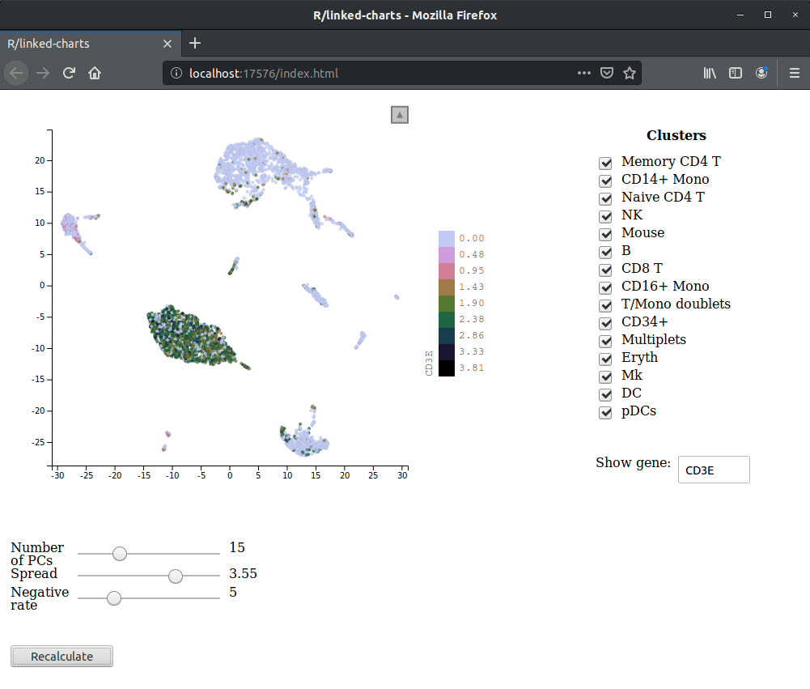

<!-- From the parent directory only! -->
<!-- knitr::knit("inputs/inputs_tutorial.Rmd", "inputs.md") -->

## R/LinkedCharts Tutorial: 
# Getting input from the web page

## Load the data
[Here](citeseq2.html), we introduced `lc_input` function and showed how to add radio buttons to the web page and then link them to a chart. 
In this tutorial we are going to explore further possibilities of this function and show how you can make your app even more interactive.
As an example, we are going to create an app that allows one interectively change parameters of a [UMAP](https://arxiv.org/abs/1802.03426) 
dimensionality reduction and see how they influence the embedding. The result will look like this



Unfortunately, for technical reasons, here, we can only show a screenshot, rather than righting the entire app in JavaScript like in all
previous tutorials. Yet, you can always download the [full R code](inputs/inputs_full.R) of the app an run it locally. Here, we are using the
same CiteSeq cord blood single-cell dataset by Stoecklin et al. ([Nature Methods, 2017](https://doi.org/10.1038/nmeth.4380)) as in other 
tutorials, but these time we've used [one of the Seurat's tutorials](https://satijalab.org/seurat/v3.1/multimodal_vignette.html) to 
preprocess the data. You can yourself follow couple of first steps from this tutorial (until cluster assignment), download 
[this script](inputs/fromSeuratTutorial.R) that has all the required preparations or directly load [the Seurat object](inputs/seuratObject.rds) in
the `.rds` format.

We start with loading this object in the memory.

```r
library(readr)

cbmc <- read_rds("seuratObject.rds")
cbmc
```

```
## An object of class Seurat 
## 20501 features across 8617 samples within 1 assay 
## Active assay: RNA (20501 features)
##  1 dimensional reduction calculated: pca
```

For this example, we are going to use only some of the information stored in this object, namely the PCA embedding, cluster assignment and 
normalized count matrix. So, for the sake of simplicity, we save these as separate variables and remove the Seurat object.

```r
clusters <- cbmc@active.ident
pca <- cbmc@reductions$pca@cell.embeddings
X <- cbmc@assays$RNA@data

rm(cbmc)

head(clusters)
```

```
## CTGTTTACACCGCTAG CTCTACGGTGTGGCTC AGCAGCCAGGCTCATT GAATAAGAGATCCCAT 
##            Mouse            Mouse            Mouse            Mouse 
## GTGCATAGTCATGCAT TACACGACACATCCGG 
##            Mouse            Mouse 
## 15 Levels: Memory CD4 T CD14+ Mono Naive CD4 T NK Mouse B ... pDCs
```

```r
pca[1:5, 1:5]
```

```
##                       PC_1      PC_2      PC_3        PC_4       PC_5
## CTGTTTACACCGCTAG -35.40905 -3.420900 0.6320372  0.40590701  0.2410551
## CTCTACGGTGTGGCTC -34.99613 -3.912628 2.2778558 -0.10634510 -0.7120762
## AGCAGCCAGGCTCATT -35.86630 -3.944900 1.6303179  0.54025670  0.5464716
## GAATAAGAGATCCCAT -35.27736 -3.929127 1.1551277  0.48948888  0.5804452
## GTGCATAGTCATGCAT -34.19374 -3.277635 1.6822643  0.04960485  0.8715711
```

```r
X[2000:2004, 1:5] #we are showing not the first rows to get some non-zero expression
```

```
## 5 x 5 sparse Matrix of class "dgCMatrix"
##         CTGTTTACACCGCTAG CTCTACGGTGTGGCTC AGCAGCCAGGCTCATT
## BCL11B                 .        0.3862658                .
## BCL2                   .        0.6642082                .
## BCL2A1                 .        .                        .
## BCL2L1                 .        .                        .
## BCL2L11                .        .                        .
##         GAATAAGAGATCCCAT GTGCATAGTCATGCAT
## BCL11B                 .                .
## BCL2                   .                .
## BCL2A1                 .                .
## BCL2L1                 .                .
## BCL2L11                .                .
```

Even though UMAP is a relatively fast dimensionality reductin tool, it still takes some time to recalculate an embedding for the full dataset. Since the
goal of this example is to demonstrate LinkedCharts functionality and let users have fun while playing with all kinds of buttons, we are going to subsample
the dataset.


```r
cells <- sample(length(clusters), 2000)

clusters <- clusters[cells]
pca <- pca[cells, ]
X <- X[, cells]
```

Now, finally, let's calculate a UMAP embedding using the first 15 principal components.

```r
library(uwot)
npca <- 15

um <- umap(pca[, 1:npca])
head(um)
```

```
##            [,1]       [,2]
## [1,]   5.812631 15.5554827
## [2,]  -1.161773  7.1273220
## [3,] -11.685457 -0.8766521
## [4,]  -1.513780  7.4060183
## [5,]  -2.360365  6.4010089
## [6,]   2.045644 -9.7356628
```

After that we are ready to make the central plot for our app.

```r
library(rlc)

openPage(useViewer = FALSE, layout = "table1x2")

lc_scatter(x = um[1, ], y = um[2, ],
           size = 2, place = "A1")
```

```
## Chart 'A1' added.
```

```
## Layer 'Layer1' is added to chart 'A1'.
```

This gives you a boring all-black plot, not much different from one you can get with base `plot()` function. Step by step, we are going to add
various features to this basic plot to make it more informative and customizable.

## Checkboxes

First, we add a way to select only some of the clusters. Later, this will allow us to recalculate the embedding with only selected cluster, but for now 
we just make not-selected cells transparent. To this end, let us add a set of checkboxes, each corresponding to a certain cluster.


```r
useClusters <- levels(clusters)
useClusters
```

```
##  [1] "Memory CD4 T"    "CD14+ Mono"      "Naive CD4 T"    
##  [4] "NK"              "Mouse"           "B"              
##  [7] "CD8 T"           "CD16+ Mono"      "T/Mono doublets"
## [10] "CD34+"           "Multiplets"      "Eryth"          
## [13] "Mk"              "DC"              "pDCs"
```

```r
lc_input(type = "checkbox", 
         labels = levels(clusters), 
         value = TRUE, 
         title = "Clusters",
         on_click = function(value) {
           useClusters <<- levels(clusters)[value]
           updateCharts("A1")
         }, 
         place = "A2")
```

```
## Chart 'A2' added.
```

`useClusters` is a variable to keep a list of currently selected clusters. We start with all clusters selected. Now `lc_input` with `type = "checkbox"`
comes in. It adds a set of checkboxes next to the main plot. `labels` is a vector of characters that are put next to each of the checkboxes. This
property also defines, how many checkboxes you want to get (by default, `lc_input` will create only one element). So, if you want, let say, 10 
checkboxes with no labels, you need to pass a vector of 10 empty strings to this property `labels = rep("", 10)`. We also put a title above our
checkboxes with `title = "Clusters"`.

`value` is very important property for ane `lc_input` object, since it describes the current state of the input block. It behaves differently for
different types of inputs. For instance, state of checkboxes is described by vector of logicals: `TRUE` for a checked box and `FALSE` for an not checked
one. `lc_input` of type `radio` is described by a single number - an index of the selected button. State of `range` and `text` is a vector of current values of each element. In case of `range` it is always a vector of numerics, while `text` uses a character vector with possible `NA`, if the 
correspoding text field is empty. Finally, `lc_input` with `type = "button"` doesn't have a state as such, but a callback function receives 
a *label* (not index!) of the clicked button.

This all may sound complicated at first, but try to play with this simple expample to get a feeling of it. It will print current state of 
`lc_input`, whenever you enter text, click button, select checkbox or radio button.

```r
lc_input(type = "checkbox", labels = paste0("el", 1:5), on_click = function(value) print(value),
         value = T)
lc_input(type = "radio", labels = paste0("el", 1:5), on_click = function(value) print(value),
         value = 1)
lc_input(type = "text", labels = paste0("el", 1:5), on_click = function(value) print(value),
         value = c("a", "b", "c", "e", "d"))
lc_input(type = "range", labels = paste0("el", 1:5), on_click = function(value) print(value),
         value = 10, max = c(10, 20, 30, 40, 50), step = c(0.5, 0.1, 1, 5, 25))
lc_input(type = "button", labels = paste0("el", 1:5), on_click = function(value) print(value))
```

`value` of the input block can be used in two directions. It is what a callback (`on_click` or `on_change`) function gets, when user interacts
with the input elements. And it is also what you can pass to the input block from the R session to change its current state. For examle, here with 
`value = TRUE` (equivalent to `value = rep(TRUE, length(levels(clusters)))`) we make sure that in the beginning all the checkboxes are checked.

The callback `on_click` function is called each time user checks or unchecks a checkbox. As it was mentioned above, it gets a verctor of `TRUE` and
`FALSE`, which we use to update a list of currently selected clusters and then update the main plot. For `lc_input` `on_click` and `on_change` are
complete synonims. You can use whichever one of them you find more intuitive. 

Now, it's only left to make use of our `useClusters` variable. So we replace our main plot with

```r
lc_scatter(dat(opacity = ifelse(clusters %in% useClusters, 0.8, 0.1)),
           x = um[, 1], y = um[, 2],
           size = 2, place = "A1")
```

```
## Layer 'Layer1' is added to chart 'A1'.
```

We have added another property `opacity` which makes cells from not selected clusters more transparent than others.
You may have noticed, that the previous version of the main plot didn't have the `dat` function, but here it appears.
The trick is that parameters inside the `dat` function are recalculated on every update call, while those outside are 
evaluated only once. If you have any doubts, you can always put everything iside the `dat` function.

## Text fields

`lc_input` of type `text` adds one or several text fields to the web page. Here, we will make one that allows user to enter a gene name
and immediately see its expression on the plot.

```r
selGene <- "CD3E"

lc_input(type = "text",
         label = "Show gene: ",
         place = "A2",
         id = "geneBox",
         value = selGene,
         on_change = function(value) {
           if(value %in% rownames(X)) {
             selGene <<- value
             updateCharts("A1", updateOnly = "ElementStyle")
           } 
         }
)
```

```
## Chart 'geneBox' added.
```
This code adds one text field labeled `Show gene:`, with initial value `CD3E` (stored in `selGene`). Whenever users enters a new gene name, it checks
whether it is really a name of a gene, which expression is stored in the count matrix, and, if so, resets the `selGene` variable and updates the main
plot. `updateOnly` here is an optional parameter that tells LinkedCharts to change only styling of points, but not there position of number. In some 
cases, it may safe performance time.

Not so obvious thing here, is why we defined `id` of the `lc_input` block. As you can see, we put in the same table cell `A2` as the set of checkboxes.
By default, LinkedCharts set an ID of each chart the same as ID of its container (`A2` in this case). But since we already have a chart with ID `A2`,
this will cause replacing our checkboxes with a text field. To avoid that we explicitly specify another ID. Now, text field is added under the
checkboxes.

Now it's time for another change in the main plot

```r
lc_scatter(dat(opacity = ifelse(clusters %in% useClusters, 0.8, 0.1),
               colourLegendTitle = selGene,
               colourValue = X[selGene, ], 
               x = um[, 1], y = um[, 2]),
           size = 2, 
           palette = rje::cubeHelix(n = 11)[9:1], 
           place = "A1")
```

```
## Layer 'Layer1' is added to chart 'A1'.
```

Here, we used normalized expression as `colourValue` and gene name as legend's title (`colourLegendTitle`). We also change default palette to Cube Helix
just to make it look nicer.

If user enters a gene that doesn't exist, nothing happens. However it may be nice to tell user why there are no changes in the main plot.
`lc_html` can help us here. This fucntion simply places a piece of HTML code to the web page.


```r
display <- "none"
lc_html(dat(content = paste0("<p style='color: red; display: ", display, "'>There is no such gene</p>")), 
        place = "A2", id = "warning")
```

```
## Chart 'warning' added.
```

This code adds a paragraph with text "There is no such gene" once again to the `A2` table cell. For this paragraph we set two style attributes.
`color: red` makes the text red and `display: none` makes the parahraph hidden. As you can notice, we assume that this attribute may 
change in time and store it in a separate variable. Now we need to make changes in the text field callback function.


```r
lc_input(type = "text",
         label = "Show gene: ",
         place = "A2",
         id = "geneBox",
         value = selGene,
         on_change = function(value) {
           if(value %in% rownames(X)) {
             display <<- "none"
             selGene <<- value
             updateCharts("A1", updateOnly = "ElementStyle")
           } else {
             display <<- "undefined"
           }
           updateCharts("warning")
         }
)
```

```
## Chart 'geneBox' added.
```

`display` here equals `none` if gene with user specified name exists and `undefined` otherwise. In any case, `lc_html` gets updated with the new
`display` value.

## Ranges and buttons

Next type of `lc_input` is `range`. It is a slider that is used to roughly specify a numeric value. Besides abovementioned parameters, ranges have three
more. `min` and `max` set minimal and maximal values that can be selected with a slider (defaults are 0 and 100 respectively). `step` is a stepping 
interval between allowed values that can be set by the slider.

In this example we will play with just three parameters of the embedding. The first one is number of principal components that is used to for
dimensionality reduction. Our default value 15 was set above (stored in `npca`). We want this parameter to be integer and allow it to accept values
from 2 to 50. `spread` determines how clustered/clumped the embedded points are. Defualt value is 1. Let it be somewhere between 0.01 and 5 with step 
0.01. Negative rate (`negRate`) in some sense defines how strongly embedded points are repelled from each other. It is going to vary from 0.5 to 20
with default value 5.

Let's sum it all up in some R code

```r
negRate <- 5
spread <- 1

lc_input(type = "range",
         label = c("Number of PCs", "Spread", "Negative rate"),
         width = 300,
         value = c(15, 1, 5),
         min = c(2, 0.01, 0.5),
         max = c(50, 5, 20),
         step = c(1, 0.01, 0.5),
         on_change = function(value) {
           npca <<- value[1]
           spread <<- value[2]
           negRate <<- value[3]
         })
```

```
## Chart 'Chart5' added.
```

We don't use `place` parameter, which means that this block of ranges will be put just under all the existing plots. There are also no changes 
made to the main plot in the callback function. Recalculating of the embedding takes some time and therefore we want to do it only after user
specifies all the parameters. So we add a button that one need to click to trigger recalculation.


```r
lc_input(type = "button",
         label = "Recalculate", 
         on_click = function(value) {
           print("Recalculation started. Please, wait...")
           inclCells <<- clusters %in% useClusters
           um <<- umap(pca[inclCells, 1:npca], negative_sample_rate = negRate, spread = spread)
           print("Recalculation finished")
           updateCharts("A1")
         })
```

```
## Chart 'Chart6' added.
```
Let's go line by line through the callback function.

First, since recalculating will take some time, we want user to be aware of this and print a message that the system is currently busy.
This message will appear in the R console. Another way is to do it directly on the web page, but we are going to leave it as an exercise for
the reader. Next, we check which cells belong to the selected clusters. Then we calculate a new embedding using only those cells and all the 
parameters set by the sliders. Now we can tell user that calculations are finished and update the main plot.

And finally, there is just one more thing left. We need to make sure, that only the cells from selected cluters are now displayed on the plot. We
also will need and initial value for `inclCells` (`TRUE` for all the cells).


```r
inclCells <- rep(T, ncol(X))

lc_scatter(dat(opacity = ifelse(clusters[inclCells] %in% useClusters, 0.8, 0.1),
               colourLegendTitle = selGene,
               colourValue = X[selGene, inclCells], 
               x = um[, 1], y = um[, 2]),
           size = 2, 
           palette = rje::cubeHelix(n = 11)[9:1], 
           place = "A1")
```

```
## Layer 'Layer1' is added to chart 'A1'.
```

Here, we are subsetting our cells for defining `opacity` and `colourValue`.

By now, if you've followed all the steps of this tutorial you should have a fully functional app in your browser. You can also download 
[the full R code](inputs/inputs_full.R).
