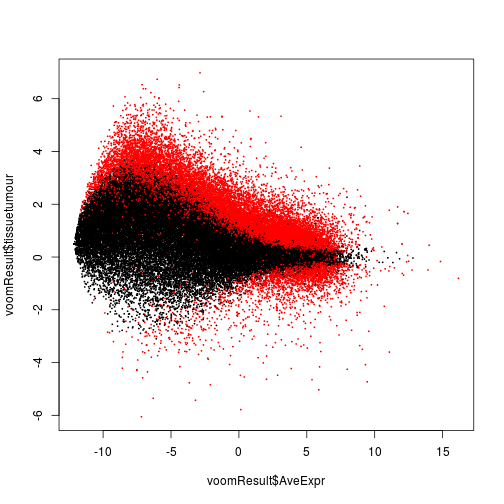

## R/LinkedCharts Tutorial
# Augmenting and checking a standard RNA-Seq analysis
## Appendix

This document describes a standard analysis of the RNA-Seq dataset used in [this tutorial](oscc.md).

We are working with data from this paper:

| C. Conway et al.: *Elucidating drivers of oral epithelial dysplasia formation and malignant transformation to cancer using RNAseq*. Oncotarget, 6:40186-40201 (2015), [doi:10.18632/oncotarget.5529](https://doi.org/10.18632/oncotarget.5529)

Conweay et al. have collected tissue samples from 19 patients with oral squamous
cell carcinoma. From each patient, they took 3 samples, one of normal oral mucosa 
("N"), one of epithelial dysplasia (i.e., abnormal but not yet malignant tissue, 
"D"), and one sample of the tumour ("T"). They prepared RNA-Seq libraries from
the samples and sequenced them. They deposited their raw data at the European
Read Archive (ERA) under accession [PRJEB7455](https://www.ebi.ac.uk/ena/data/view/PRJEB7455) 
(secondary accession: ERP007185). 

The Recount2 project (Collado Torres et al., Nature Biotechnology, 2017, 
[doi:10.1038/nbt.3838](https://doi.org/10.1038/nbt.3838)) has downloaded this
data set (and thousands other RNA-Seq data sets), ran it through a standardized
preprocessing pipeline and provides a gene count table for download from the
[Recount2 web site](https://jhubiostatistics.shinyapps.io/recount/).

### Getting data and metadata

We download this count matrix from Recount2 (available via the secondary accession
ERP007185) and read it into R


```r
download.file("http://duffel.rail.bio/recount/v2/ERP007185/counts_gene.tsv.gz", 
  "ERP007185_counts_gene.tsv.gz" )

countMatrix <- as.matrix( read.table( 
  gzfile("ERP007185_counts_gene.tsv.gz"), header=TRUE, row.names="gene_id" ) )
```

The upper-left corner of the matrix looks like this


```r
countMatrix[1:5,1:5]
```

```
##                    ERR649035 ERR649053 ERR649022 ERR649026 ERR649029
## ENSG00000000003.14     37354    136965     96040    144832    261208
## ENSG00000000005.5        371       119      1100      1139      1635
## ENSG00000000419.12     55566     53733     29553    111980     54818
## ENSG00000000457.13     77985     73875     44700     89683     83028
## ENSG00000000460.16     25159     31507     20118     37592     38827
```

The column names are ERA run accessions, whcih we first need to map to useful sample 
names. Unfortuantely, the sample table available from Recount2 does not contain a
column that would actually describe the samples, the more complete sample table 
available from ERA, however, does (though it took us a bit to find this).

We went to the [ERA page for the project](https://www.ebi.ac.uk/ena/data/view/PRJEB7455).
There, we clicked on "Select column" and selected the columns "Run accession" and 
"Submitter's sample name", then downloaded this table. A copy of this table is available
from the present site: [PRJEB7455.txt](PRJEB7455.txt).

We will use [tidyverse](https://www.tidyverse.org/) functionality to process the table


```r
library( tidyverse )
```

We read in the table


```r
sampleTable <- read_tsv( "PRJEB7455.txt" )
```

```
## Parsed with column specification:
## cols(
##   run_accession = col_character(),
##   sample_alias = col_character()
## )
```

```r
sampleTable
```

```
## # A tibble: 57 x 2
##    run_accession sample_alias
##    <chr>         <chr>       
##  1 ERR649018     PG038-D     
##  2 ERR649019     PG136-N     
##  3 ERR649020     PG049-T     
##  4 ERR649021     PG049-D     
##  5 ERR649022     PG049-N     
##  6 ERR649023     PG063-D     
##  7 ERR649024     PG063-T     
##  8 ERR649025     PG038-T     
##  9 ERR649026     PG063-N     
## 10 ERR649027     PG108-T     
## # ... with 47 more rows
```

We split the sample name into its two parts, the patient ID (before the dash) and 
the tissue type (after the dash), then change the tissue type to more descriptive labels,
impose an ordering of the levels by severity ( normal < dysplasia < tumour ), and finally
sort the table.


```r
sampleTable %>%
   rename( sample_name = sample_alias ) %>%
   separate( sample_name, c( "patient", "tissue" ), "-", remove=FALSE ) %>%
   mutate( tissue = fct_recode( tissue, "normal"="N", "dysplasia"="D", "tumour"="T" ) ) %>%
   mutate( tissue = fct_relevel( tissue, "normal", "dysplasia", "tumour" ) ) %>%
   arrange( patient, tissue ) ->
      sampleTable
```

This is now our final sample table


```r
sampleTable
```

```
## # A tibble: 57 x 4
##    run_accession sample_name patient tissue   
##    <chr>         <chr>       <chr>   <fct>    
##  1 ERR649059     PG004-N     PG004   normal   
##  2 ERR649060     PG004-D     PG004   dysplasia
##  3 ERR649061     PG004-T     PG004   tumour   
##  4 ERR649035     PG038-N     PG038   normal   
##  5 ERR649018     PG038-D     PG038   dysplasia
##  6 ERR649025     PG038-T     PG038   tumour   
##  7 ERR649022     PG049-N     PG049   normal   
##  8 ERR649021     PG049-D     PG049   dysplasia
##  9 ERR649020     PG049-T     PG049   tumour   
## 10 ERR649026     PG063-N     PG063   normal   
## # ... with 47 more rows
```

Now, we bring the count matrix columns into the same order as in the sample table
and replace the run accessions in the column names by the more readable sample names


```r
countMatrix <- countMatrix[ , sampleTable$run_accession ]
colnames(countMatrix) <- sampleTable$sample_name
```

Next, we replace the rownames, currently Ensembl gene IDs, with gene names. To this, we first download
from Ensembl Biomart a table mapping all Ensembl human gene IDs to gene symbols


```r
bmtbl <- biomaRt::getBM( 
   c( "ensembl_gene_id", "external_gene_name" ), 
   mart = biomaRt::useEnsembl( "ensembl", "hsapiens_gene_ensembl" ) )

head(bmtbl)
```

```
##   ensembl_gene_id external_gene_name
## 1 ENSG00000284532            MIR4723
## 2 ENSG00000238933            RF00019
## 3 ENSG00000275693            RF02116
## 4 ENSG00000275451            MIR6085
## 5 ENSG00000222870         RNU6-1328P
## 6 ENSG00000252023          RNU6-581P
```

We replace the rownames with the gene symbols, unless the gene symbol is missing or duplicated.
As usual in R, such simple operations look most complicated:


```r
tibble( rowname = rownames(countMatrix) ) %>% 
   mutate( ensembl_gene_id = str_extract( rowname, "ENSG\\d*" ) ) %>%
   left_join( bmtbl, by = "ensembl_gene_id" ) %>%
   mutate( new_rowname = 
      ifelse( ! is.na(external_gene_name) & 
            ! external_gene_name %in% external_gene_name[duplicated(external_gene_name)], 
         external_gene_name, 
         rowname ) ) %>%
   pull( new_rowname ) ->
     rownames(countMatrix)
```

Now, we have this


```r
countMatrix[ 1:5, 1:5 ]
```

```
##          PG004-N PG004-D PG004-T PG038-N PG038-D
## TSPAN6     11642   25423    1526   37354   30699
## TNMD         405       0    1628     371       0
## DPM1       21828   32694     973   55566   33814
## SCYL3      31332   38436   11661   77985   63853
## C1orf112   14207   21808    8047   25159   25862
```

### Running limma-voom

With everything in place, we now run a standard differential expression analysis using
limma-voom (Law et al., Genome Biology, 2014, [doi:10.1186/gb-2014-15-2-r29](https://doi.org/10.1186/gb-2014-15-2-r29)).


```r
library( limma )
```

We aim to find any genes which differ significantly between any of the three tissue types,
accounting for the patient as a blocking factor.

This is our model matrix


```r
mm <- model.matrix( ~ patient + tissue, sampleTable )
colnames(mm)
```

```
##  [1] "(Intercept)"     "patientPG038"    "patientPG049"   
##  [4] "patientPG063"    "patientPG079"    "patientPG086"   
##  [7] "patientPG105"    "patientPG108"    "patientPG114"   
## [10] "patientPG122"    "patientPG123"    "patientPG129"   
## [13] "patientPG136"    "patientPG137"    "patientPG144"   
## [16] "patientPG146"    "patientPG174"    "patientPG187"   
## [19] "patientPG192"    "tissuedysplasia" "tissuetumour"
```

The model matrix columns concerning the tissue type are the last two


```r
mm_tissue_columns <- which( attr( mm, "assign" ) == 2 )
mm_tissue_columns
```

```
## [1] 20 21
```

Now, we run the standard workflow of voom and limma


```r
vm <- voom( countMatrix, mm )
fit <- lmFit( vm, mm )
fit <- eBayes( fit, robust=TRUE )
```

Last, we extract the results for an F test comparing the full model with the one missing the
last two columns, to see which genes differ significantly between tissues.


```r
voomResult <- topTable( fit, coef = mm_tissue_columns, number=Inf, sort.by="none" )

head(voomResult)
```

```
##          tissuedysplasia tissuetumour   AveExpr         F      P.Value
## TSPAN6        -0.6794364  -1.17596765  3.940362 17.369998 2.751020e-06
## TNMD          -2.2216329   0.29408807 -4.690724  4.164227 2.206521e-02
## DPM1           0.3353803   0.14224571  3.551261  1.659938 2.018351e-01
## SCYL3          0.2533487   0.06609826  4.212959  2.152911 1.282229e-01
## C1orf112       0.3422943   0.32698821  3.350802  3.262281 4.774102e-02
## FGR            0.6687112   1.06189945  2.673165  7.042142 2.221402e-03
##             adj.P.Val
## TSPAN6   8.515251e-05
## TNMD     7.345409e-02
## DPM1     3.391010e-01
## SCYL3    2.492604e-01
## C1orf112 1.264950e-01
## FGR      1.397246e-02
```

Let's make an MA plot of these, showing the log fold change tumour/normal versus the average expression and
highlighting genes significant at 10% FDR in the F test.


```r
plot( voomResult$AveExpr, voomResult$tissuetumour, 
   col = ifelse( voomResult$adj.P.Val < .1, "red", "black" ), pch=20, cex=.3 )
```



### Save the results

We save the result 


```r
save( countMatrix, sampleTable, voomResult, file="orcc.rda" )
```

This file is available here: [orcc.rda](orcc.rda)


### Session info


```r
sessionInfo()
```

```
## R version 3.4.2 (2017-09-28)
## Platform: x86_64-pc-linux-gnu (64-bit)
## Running under: Ubuntu 16.04.3 LTS
## 
## Matrix products: default
## BLAS: /usr/lib/openblas-base/libblas.so.3
## LAPACK: /usr/lib/libopenblasp-r0.2.18.so
## 
## locale:
##  [1] LC_CTYPE=en_US.UTF-8       LC_NUMERIC=C              
##  [3] LC_TIME=en_US.UTF-8        LC_COLLATE=en_US.UTF-8    
##  [5] LC_MONETARY=en_US.UTF-8    LC_MESSAGES=en_US.UTF-8   
##  [7] LC_PAPER=en_US.UTF-8       LC_NAME=C                 
##  [9] LC_ADDRESS=C               LC_TELEPHONE=C            
## [11] LC_MEASUREMENT=en_US.UTF-8 LC_IDENTIFICATION=C       
## 
## attached base packages:
## [1] stats     graphics  grDevices utils     datasets  methods   base     
## 
## other attached packages:
##  [1] limma_3.34.9    bindrcpp_0.2.2  forcats_0.3.0   stringr_1.3.1  
##  [5] dplyr_0.7.6     purrr_0.2.5     readr_1.1.1     tidyr_0.8.1    
##  [9] tibble_1.4.2    ggplot2_3.0.0   tidyverse_1.2.1
## 
## loaded via a namespace (and not attached):
##  [1] Rcpp_0.12.18         lubridate_1.7.4      lattice_0.20-35     
##  [4] prettyunits_1.0.2    assertthat_0.2.0     digest_0.6.17       
##  [7] utf8_1.1.4           R6_2.2.2             cellranger_1.1.0    
## [10] plyr_1.8.4           backports_1.1.2      stats4_3.4.2        
## [13] RSQLite_2.1.1        evaluate_0.11        highr_0.7           
## [16] httr_1.3.1           pillar_1.3.0         rlang_0.2.2         
## [19] progress_1.2.0       lazyeval_0.2.1       curl_3.2            
## [22] readxl_1.1.0         rstudioapi_0.7       blob_1.1.1          
## [25] S4Vectors_0.16.0     statmod_1.4.30       RCurl_1.95-4.11     
## [28] bit_1.1-14           biomaRt_2.34.2       munsell_0.5.0       
## [31] broom_0.5.0          compiler_3.4.2       modelr_0.1.2        
## [34] pkgconfig_2.0.2      BiocGenerics_0.24.0  tidyselect_0.2.4    
## [37] IRanges_2.12.0       XML_3.98-1.16        fansi_0.3.0         
## [40] crayon_1.3.4         withr_2.1.2          bitops_1.0-6        
## [43] grid_3.4.2           nlme_3.1-137         jsonlite_1.5        
## [46] gtable_0.2.0         DBI_1.0.0            magrittr_1.5        
## [49] scales_1.0.0         cli_1.0.0            stringi_1.2.4       
## [52] xml2_1.2.0           org.Hs.eg.db_3.5.0   tools_3.4.2         
## [55] bit64_0.9-7          Biobase_2.38.0       glue_1.3.0          
## [58] hms_0.4.2            parallel_3.4.2       AnnotationDbi_1.40.0
## [61] colorspace_1.3-2     rvest_0.3.2          memoise_1.1.0       
## [64] knitr_1.20           bindr_0.1.1          haven_1.1.2
```
